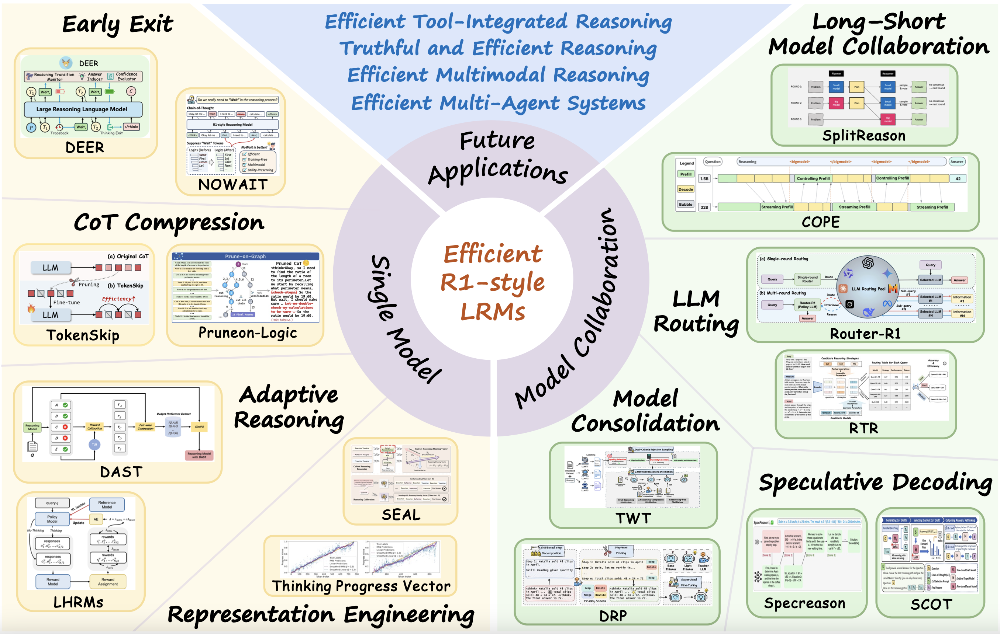
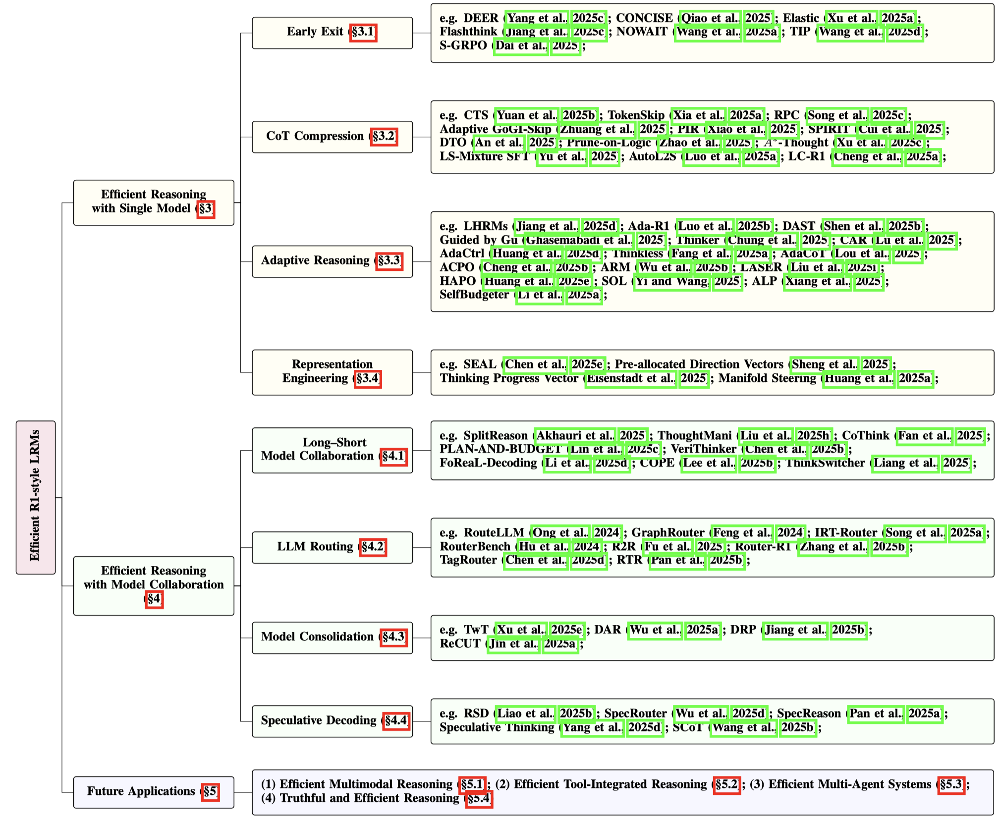

<h1 align="center">
 <em>Don't Overthink It</em>: A Survey of Efficient R1-style 
 
  Large Reasoning Models
</h1>

This repository is for our paper:

> **[Efficient Reasoning Models: A Survey](https://arxiv.org/abs/2504.10903)** \
> [Sicheng Feng](https://fscdc.github.io/)1,2, [Gongfan Fang](https://fangggf.github.io/)1, [Xinyin Ma](https://horseee.github.io/)1, [Xinchao Wang](https://sites.google.com/site/sitexinchaowang/)1,* \
> 1National University of Singapore, Singapore \
> 2Nankai University, Tianjin, China \
> ∗Corresponding author: xinchao@nus.edu.sg
> 

# 📋 Overview 

Recently, Large Reasoning Models (LRMs) have gradually become a research hotspot due to their outstanding performance in handling complex tasks. Among them, DeepSeek R1 has garnered significant attention for its exceptional performance and open-source nature, driving advancements in the research of R1-style LRMs. Unlike traditional Large Language Models (LLMs), these models enhance logical deduction and decision-making capabilities during reasoning by incorporating mechanisms such as long chain-of-thought and self-reflection through reinforcement learning. However, with the widespread application of these models, the problem of "*overthinking*" has gradually emerged.  By  reviewing the current research advancements in the field of efficient reasoning methods systematically, we categorize existing works into two main directions based on the number of models involved in the reasoning process: (1) Efficient Reasoning with Single Model, which focuses on improving the reasoning efficiency of individual models; and (2) Efficient Reasoning with Model Collaboration, which explores optimizing reasoning paths through collaboration among multiple models.

------

# 📑 Table of Contents 

- [Selected Papers](#-Selected-Papers)
  - [Efficient Reasoning with Single Model](#-Efficient-Reasoning-with-Single-Model)
    - [Early Exit](#Early-Exit)
    - [CoT Compression](#CoT-Compression)
    - [Adaptive Reasoning](#Adaptive-Reasoning)
    - [Representation Engineering based Efficient Reasoning](#Representation-Engineering-based-Efficient-Reasoning)
  - [Efficient Reasoning with Model Collaboration](#-Efficient-Reasoning-with-Model-Collaboration)
    - [Long–Short Model Collaboration](#Long–Short-Model-Collaboration)
    - [LLM Routing](#LLM-Routing)
    - [Model Consolidation](#Model-Consolidation)
    - [Speculative Decoding](#Speculative-Decoding)
- [Citation](#-Citation)
- [Acknowledgements](#-Acknowledgements)
------

# 📚 Selected Papers [/All Paper](./paper-list.md)

## 🌟 Efficient Reasoning with Single Model
Efficient reasoning with single model aims to achieve efficient reasoning by optimizing the reasoning process of a single model. This approach focuses on minimizing computational resources and reasoning time while maintaining reasoning accuracy, ensuring that the model can quickly and accurately generate answers. Specific methods include Early Exit, CoT Compression, Adaptive Reasoning , and Representation Engineering-based Efficient Reasoning.

### Early Exit

  
 To Think or Not to Think: Exploring the Unthinking Vulnerability in Large Reasoning Models <a href="https://arxiv.org/pdf/2502.12202" target="_blank">
    [Paper]
</a>

| English Note                                                 | Chinese Note                                                 |
| ------------------------------------------------------------ | ------------------------------------------------------------ |
| The authors propose the **Monitoring of Thought (MoT)** framework, which dynamically evaluates the necessity of deep reasoning both before and during the inference process of a large reasoning model. Once it determines that the current input or reasoning is sufficient, MoT immediately terminates the reasoning process, thereby avoiding redundant computation and improving efficiency. | 作者提出了思维监控框架（Monitoring of Thought, MoT），该框架在推理大模型接收输入前及推理过程中动态评估是否需要进行深度思考。一旦判断当前输入或推理已足够，MoT即刻终止推理过程，避免冗余计算，提高效率。 |

                                                                                                             

 Dynamic Early Exit in Reasoning Models <a href="https://arxiv.org/pdf/2504.15895" target="_blank">
    [Paper]
</a>

| English Note                                                 | Chinese Note                                                 |
| ------------------------------------------------------------ | ------------------------------------------------------------ |
| This paper proposes **DEER**, a **training-free dynamic early-exit reasoning** method. DEER first detects pivotal keywords (e.g., *“wait”*) in long chain-of-thought (CoT) sequences and replaces them with guiding tokens such as *“final answer”* to prompt the model to generate a **tentative answer** based on the current reasoning context. The **confidence** of the tentative answer is then evaluated: if sufficiently high, the answer is returned directly; otherwise, the model rolls back to the turning point and continues reasoning. To further improve efficiency, DEER introduces a **branch-parallel acceleration strategy** that executes tentative answer evaluation and continued reasoning in parallel, significantly improving inference speed and resource utilization. | 该论文提出一种**无需训练的动态推理提前退出方法 DEER**。该方法首先在长 CoT 中检测具有转折意义的关键词（如 “wait”），并将其替换为“final answer”等引导词，提示模型基于当前推理内容生成**试探性答案**。随后，评估该答案的**置信度**：若置信度足够高则直接输出，反之则回退至转折点继续推理。为提升推理效率，DEER进一步设计了**分支并行加速策略**，将试探性答案评估与后续推理并行执行，有效提升整体推理速度与资源利用率。 |
 
                                                  

ConCISE: Confidence-guided Compression in Step-by-step Efficient Reasoning <a href="https://arxiv.org/pdf/2505.04881" target="_blank">
    [Paper]
</a>

| English Note                                                 | Chinese Note                                                 |
| ------------------------------------------------------------ | ------------------------------------------------------------ |
| This paper proposes the **CONCISE** framework. The authors identify two typical redundancy patterns in reasoning: (1) **Confidence Deficit**, where the model underestimates its correct intermediate reasoning steps, triggering unnecessary self-reflection; and (2) **Termination Delay**, where the model continues reflecting even after generating the correct answer. To address these issues, CONCISE introduces two techniques: **Confidence Injection**, which inserts high-confidence phrases to boost the model's trust in its intermediate reasoning; and **Early Stopping**, which employs a confidence detector to monitor model certainty and halts generation once a predefined threshold is exceeded. | 这篇论文提出 CONCISE 框架。作者首先归纳了推理中存在两种典型冗余模式：一是置信度不足（Confidence Deficit），即模型低估自身正确推理步骤，从而触发不必要的反思；二是终止延迟（Termination Delay），即生成正确答案后仍持续反思，造成冗余。为此，CONCISE框架**置信度注入（Confidence Injection）方法，通过插入高置信度短语提升模型对中间推理的信任度。提前终止（Early Stopping）方法通过置信度探测器监控模型置信度，在超过设定阈值时终止生成。 |

                                                   

 Think or Not? Exploring Thinking Efficiency in Large Reasoning Models via an Information-Theoretic Lens<a href="https://arxiv.org/pdf/2505.18237" target="_blank">
    [Paper]
</a>

| English Note                                                 | Chinese Note                                                 |
| ------------------------------------------------------------ | ------------------------------------------------------------ |
| This paper revisits the efficiency of reasoning paths in large language models from an information-theoretic perspective, revealing a fundamental trade-off between *reasoning length* and *semantic efficiency*. The authors introduce two novel metrics: **InfoBias**, which measures the deviation of a model’s reasoning path from the ideal path, and **InfoGain**, which quantifies the information increment brought by each reasoning step. Empirical studies show that longer reasoning paths exhibit higher InfoBias and diminishing InfoGain, especially when generating incorrect answers. To address this, the paper proposes an **information entropy–based adaptive reasoning mechanism**, which includes a dynamic stopping strategy (terminating reasoning early when InfoGain remains below a threshold for *k* consecutive steps) and entropy-regularized training (introducing an entropy loss during fine-tuning to encourage the model to terminate early under low-entropy conditions). | 本文从信息论视角重新审视了大型语言模型推理路径的效率问题，揭示了“推理长度”与“语义效率”之间存在基本权衡关系。作者引入了两个新指标：**InfoBias**（衡量模型推理路径偏离理想路径的程度）和 **InfoGain**（衡量每步推理所带来的信息增量），并通过实证研究发现：推理路径越长，信息偏差越高、信息增益越递减，特别是在生成错误答案时更为显著。为此，提出了一种**基于信息熵的自适应推理机制**，包括动态终止机制（当连续k步的InfoGain低于阈值时，提前终止推理）和熵正则化训练（在微调阶段引入熵损失函数，鼓励模型在低熵状态下提前终止）。 |

                                               

 Scalable Chain of Thoughts via Elastic Reasoning<a href="https://arxiv.org/pdf/2505.05315" target="_blank">
    [Paper]
</a>

| English Note                                                 | Chinese Note                                                 |
| ------------------------------------------------------------ | ------------------------------------------------------------ |
| This paper proposes the **Elastic Reasoning** method, which divides the token budget of the reasoning process into two parts: the thinking phase and the answering phase, enabling controllable and adaptive management of reasoning length. The method enforces early termination of the reasoning once the token budget for the thinking phase is reached, ensuring the completeness of the answering phase. | 这篇论文提出了弹性推理（Elastic Reasoning）方法，通过将推理过程的token预算分为思考阶段和解答阶段两部分，实现对推理长度的可控和自适应管理。该方法通过在思考阶段达到预算上限时强制结束推理，保证了解答部分的完整性。 |
 
                                                

 Answer Convergence as a Signal for Early Stopping in Reasoning<a href="https://arxiv.org/pdf/2506.02536" target="_blank">
    [Paper]
</a>

| English Note                                                 | Chinese Note                                                 |
| ------------------------------------------------------------ | ------------------------------------------------------------ |
| This paper addresses the issues of verbosity and redundancy in chain-of-thought reasoning of large language models (LLMs) and proposes three early stopping strategies to improve inference efficiency: (1) an unsupervised stopping mechanism based on answer consistency, which detects convergence by monitoring the consistency of consecutive output answers; (2) a decoding strategy that adjusts the probability of generating an “end-of-reasoning” token to encourage early termination; and (3) a supervised learning method leveraging internal model activation sequences, where an LSTM models reasoning progress to dynamically predict the optimal stopping point. | 这篇论文针对大型语言模型（LLMs）链式思维推理中存在的冗长和冗余问题，提出了三种推理过程中的提前终止策略以提升推理效率：基于答案一致性的无监督停止机制，通过监测连续输出答案的一致性判断推理是否收敛；基于结束标记概率调整的解码策略，提升模型生成“推理结束”标记的概率以促使提前停止；以及基于模型内部激活序列的监督学习方法，利用LSTM对推理进度进行建模，动态预测最佳停止点。 |

                                                

 Reasoning Models Know When They’re Right: Probing Hidden States for Self-Verification<a href="https://arxiv.org/pdf/2504.05419" target="_blank">
    [Paper]
</a>

| English Note                                                 | Chinese Note                                                 |
| ------------------------------------------------------------ | ------------------------------------------------------------ |
| This paper segments the full reasoning process into several chunks, with the model generating an intermediate answer at the end of each chunk. Each intermediate answer is labeled with a binary supervision signal (*y* ∈ {0, 1}) indicating whether it corresponds to the final correct answer. The final hidden state of each chunk is extracted as the input feature *x*, forming a training dataset of (*x*, *y*) pairs. A multi-layer perceptron (MLP) probe is then trained to predict the probability that a given intermediate answer is correct. During inference, if the predicted probability of an intermediate answer being correct exceeds a certain threshold, reasoning is terminated early and the answer is output, thereby reducing unnecessary computational overhead. | 本文将完整的推理过程划分为若干个 chunk，并在每个 chunk 末尾由模型生成一个中间答案，标注其是否为最终正确答案（以 0/1 作为监督信号 y）。同时，提取每个 chunk 对应的最后一个 hidden state 作为输入特征 x，构建训练数据集 (x, y)。在此基础上训练一个 MLP 探针，用于预测当前答案为正确答案的概率。在推理阶段，当模型生成的某一中间答案被判定为正确概率较高时，即可提前终止推理并输出该答案，从而有效减少不必要的计算开销。 |
 
                                                 

#### 

FlashThink: An Early Exit Method For Efficient Reasoning <a href="https://arxiv.org/pdf/2505.13949" target="_blank">
    [Paper]
</a>

| English Note                                                 | Chinese Note                                                 |
| ------------------------------------------------------------ | ------------------------------------------------------------ |
| FlashThink designs an early stopping mechanism based on a verification model. This method divides the reasoning content into multiple segments and uses a trained verification model to determine whether the current segment is sufficient to produce the correct answer, thereby deciding whether to terminate reasoning early. | FlashThink 设计了一种基于验证模型的早停机制。该方法将推理内容划分为多个片段，利用训练好的验证模型判断当前推理片段是否已足够得到正确答案，从而决定是否提前终止推理。 |

                                             

 Wait, We Don’t Need to “Wait” ! Removing Thinking Tokens Improves Reasoning Efficiency<a href="https://arxiv.org/pdf/2506.08343" target="_blank">
    [Paper]
</a>

| English Note                                                 | Chinese Note                                                 |
| ------------------------------------------------------------ | ------------------------------------------------------------ |
| This paper proposes the **NOWAIT** method, which employs a logit processor during inference to **effectively prohibit the generation of specific key tokens**. For any designated key tokens, its corresponding logit value is set to a large negative number during generation, making tokens related to self-reflection nearly impossible to be sampled by the model, thereby enabling more efficient reasoning. The suppressed key tokens include:  “wait,” “alternatively,” “hmm,” “but,” “however,” “alternative,” “another,” “check,” “double-check,” “oh,” “maybe,” “verify,” “other,” “again,” “now,” “ah,” and “any.” | 本文提出NOWAIT方法 ,在推理过程中采用 logit 处理器，**有效禁止模型生成特定关键词**。对于任意指定关键词，生成时直接将其对应的 logit 值设置为极大负数，从而使与反思相关的 token 几乎不可能被模型采样，进而实现高效推理。关键词包括：  “wait”, “alternatively”, “hmm”, “but”, “however”, “alternative”, “another”, “check”, “double-check”, “oh”, “maybe”, “verify”, “other”, “again”, “now”, “ah”, “any” |
 
                                             

#### 

 Thoughts Are All Over the Place: On the Underthinking of o1-Like LLMs<a href="https://arxiv.org/pdf/2501.18585" target="_blank">
    [Paper]
</a>

| English Note                                                 | Chinese Note                                                 |
| ------------------------------------------------------------ | ------------------------------------------------------------ |
| Wang et al. propose the **Thought Switching Penalty (TIP)**, which adjusts the logits of **tokens associated with thought transitions**. | Wang等人提出思路切换惩罚方法（TIP, Thought Switching Penalty），对**与思路切换相关的 token**的 logits进行调整。 |
 
                                               

#### 

 Efficient Reasoning Through Suppression of Self-Affirmation Reflections in Large Reasoning Models <a href="https://www.arxiv.org/pdf/2506.12353" target="_blank">
    [Paper]
</a>

| English Note | Chinese Note |
| ------------ | ------------ |
|              |              |

  

#### 

S-GRPO: Early Exit via Reinforcement Learning in Reasoning Models <a href="https://arxiv.org/pdf/2505.07686" target="_blank">
    [Paper]
</a>

| English Note                                                 | Chinese Note                                                 |
| ------------------------------------------------------------ | ------------------------------------------------------------ |
| This method inserts  \textit{*early exit*} instructions at different positions within a single reasoning chain to construct multiple serial reasoning path groups. It then applies a decaying reward strategy based on the exit position: the earlier the model terminates reasoning while still producing a correct answer, the higher the reward it receives. This guides the model to stop reasoning as early as possible without sacrificing accuracy. | S-GRPO（Serial-Group Decaying-Reward Policy Optimization）方法通过在单条思维链不同位置插入“提前退出”指令，构造串行推理路径组，并结合基于退出位置的递减奖励策略，引导模型在保证正确性的前提下尽早终止推理。相比并行采样路径的GRPO，S-GRPO以更精细的方式建模推理充分性，提升推理效率与答案准确性 |
 
                         

### CoT Compression

Not All Tokens Are What You Need In Thinking <a href="https://arxiv.org/pdf/2505.17827" target="_blank">
    [Paper]
</a>

| English Note                                                 | Chinese Note                                                 |
| ------------------------------------------------------------ | ------------------------------------------------------------ |
| This paper proposes a method called **Conditional Token Selection (CTS)** for compressing chain-of-thought (CoT) reasoning data. CTS trains a reference model to assess the importance of tokens during the reasoning process and dynamically removes less important tokens based on metrics such as perplexity, producing a compressed dataset. The model is then fine-tuned on this compressed dataset to achieve more efficient reasoning capabilities. | 本文提出了一种名为Conditional Token Selection（CTS）的方法，用于压缩链式思维（CoT）推理数据。CTS通过训练参考模型评估推理过程中的Token重要性，并根据困惑度等指标动态去除不重要的Token，生成压缩后的数据集。随后，模型在该压缩数据集上进行微调，从而实现更高效的推理能力。 |

 

#### 

TokenSkip: Controllable Chain-of-Thought Compression in LLMs <a href="https://arxiv.org/pdf/2502.12067" target="_blank">
    [Paper]
</a>

| English Note                                                 | Chinese Note                                                 |
| ------------------------------------------------------------ | ------------------------------------------------------------ |
| This paper proposes **TokenSkip**, a reasoning compression method that first evaluates the importance of each token during the reasoning process. Based on a preset compression rate, a pruning threshold is determined to retain tokens with importance above the threshold, thereby generating a condensed version of the chain-of-thought (CoT). During training, the authors construct a new training set using the compressed reasoning trajectories for fine-tuning. At inference, TokenSkip enables controllable compression. | 该论文提出了一种名为 **TokenSkip** 的推理压缩方法，首先衡量**推理过程中每个 token 的重要性**，根据预设的**压缩率确定裁剪阈值，保留高于阈值的 token，从而生成精简版的推理链（CoT）。在训练阶段，作者利用压缩后的推理轨迹构建新训练集，并进行微调。在推理阶段可实现可控压缩。 |

 

#### 

 Reasoning Path Compression: Compressing Generation Trajectories for Efficient LLM Reasoning<a href="https://arxiv.org/pdf/2505.13866" target="_blank">
    [Paper]
</a>

| English Note                                                 | Chinese Note                                                 |
| ------------------------------------------------------------ | ------------------------------------------------------------ |
| **Reasoning Path Compression (RPC)** improves inference efficiency by periodically compressing the key-value (KV) cache in large reasoning models. The method leverages attention-based importance scoring to evaluate recently generated tokens and retains only high-impact cache entries, thereby reducing redundant computational overhead. | Reasoning Path Compression（RPC）通过周期性压缩推理大模型中的键值缓存（KV cache）来提高推理效率。该方法利用注意力机制对近期生成的 token 进行重要性评分，仅保留高影响力的缓存条目，从而减少冗余计算开销。 |

 

#### 

Accelerating Chain-of-Thought Reasoning: When Goal-Gradient Importance Meets Dynamic Skipping <a href="https://arxiv.org/pdf/2505.08392" target="_blank">
    [Paper]
</a>

| English Note                                                 | Chinese Note                                                 |
| ------------------------------------------------------------ | ------------------------------------------------------------ |
| This approach first quantifies the contribution of each token to the final prediction by computing the loss. Then, it introduces a dynamic pruning strategy based on uncertainty: when the model’s prediction entropy is high, indicating greater task difficulty, pruning is reduced; conversely, when entropy is low, more aggressive pruning is allowed. In addition, an Adaptive N-Constraint mechanism is used to limit the number of consecutively pruned tokens based on the moving average of entropy, preserving the continuity of reasoning. Based on these strategies, a compressed dataset is constructed for retraining the model. | 本文提出了 Adaptive GoGI-Skip 方法。该方法通过计算损失函数，量化每个 token 对最终推理结果的贡献，从而精准识别关键推理信息。在此基础上，引入基于不确定性的动态剪枝策略，首先利用模型在每一步的预测熵作为不确定性指标：当预测熵较高，表明推理任务较复杂，相应减少压缩力度；而在预测熵较低时，则允许更多的剪枝。同时，方法采用 Adaptive N-Constraint（ANC）机制，根据滑动窗口内的平均预测熵动态限制连续可剪枝的 token 数量，有效保障推理过程的连贯性。在此基础上构建压缩数据集。 |

 

#### 

 LIMOPro: Reasoning Refinement for Efficient and Effective Test-time Scaling<a href="https://arxiv.org/pdf/2505.19187" target="_blank">
    [Paper]
</a>

| English Note                                                 | Chinese Note                                                 |
| ------------------------------------------------------------ | ------------------------------------------------------------ |
| This paper proposes the **Perplexity-based Importance Refinement (PIR)** framework, which systematically distinguishes between progressive reasoning steps and functional steps within reasoning chains. Leveraging perplexity-based quantitative metrics, PIR selectively prunes low-importance functional reasoning steps to construct a refined dataset for model fine-tuning, thereby improving reasoning efficiency. | 该论文提出了PIR（Perplexity-based Importance Refinement）框架，通过系统划分推理链中的渐进式推理和功能性步骤，结合基于困惑度的量化指标，有选择地剪除低重要性的功能性推理步骤，构造新的数据集用于模型微调，提升模型的推理效率。 |

 

#### 

 Stepwise Perplexity-Guided Refinement for Efficient Chain-of-Thought Reasoning in Large Language Models<a href="https://arxiv.org/pdf/2502.13260" target="_blank">
    [Paper]
</a>

| English Note                                                 | Chinese Note                                                 |
| ------------------------------------------------------------ | ------------------------------------------------------------ |
| SPIRIT addresses both few-shot CoT prompting and fine-tuning scenarios. SPIRIT iteratively removes or merges reasoning steps based on perplexity, while designing demonstration refinement or training data optimization strategies to ensure that the resulting reasoning chains remain both concise and semantically coherent. | 这篇论文提出了SPIRIT算法，旨在通过识别和去除推理链中不重要的步骤，提升大语言模型链式推理的效率和连贯性。针对少样本链式推理和微调两种应用场景，SPIRIT分别设计了精炼演示示例和优化训练数据的策略，结合困惑度指标进行迭代式步骤移除与合并，确保推理过程既简洁又保持语义连贯。 |

 

#### 

 R1-Compress: Long Chain-of-Thought Compression via Chunk Compression and Search<a href="https://arxiv.org/pdf/2505.16838" target="_blank">
    [Paper]
</a>

| English Note                                                 | Chinese Note                                                 |
| ------------------------------------------------------------ | ------------------------------------------------------------ |
| This work proposes a multi-stage reasoning compression method. The method first segments the model-generated solution process into semantically coherent chunks. Then, an auxiliary language model is used to generate multiple simplified candidates for each chunk. A greedy selection strategy is applied across chunks to choose candidates that best balance conciseness and fidelity (measured by low language model loss). The resulting high-quality compressed reasoning dataset is then used to fine-tune the model, enabling more efficient reasoning. | 这项工作提出了一种多阶段的推理压缩方法。该方法首先将模型生成的解题过程划分为结构清晰的语义段（chunk），随后利用辅助语言模型对每个段落生成多个简化候选版本。在段落之间采用贪心搜索策略，优先选择在简洁性和保真性（低语言模型损失）之间取得最佳平衡的候选，最终构建出压缩后的高质量推理数据集，通过微调模型实现高效推理。 |

 

#### 

 Don’t Think Longer, Think Wisely: Optimizing Thinking Dynamics for Large Reasoning Models<a href="https://arxiv.org/pdf/2505.21765" target="_blank">
    [Paper]
</a>

| English Note                                                 | Chinese Note                                                 |
| ------------------------------------------------------------ | ------------------------------------------------------------ |
| This paper proposes the **Dynamic Thought-mode Optimization (DTO)** framework, which segments the reasoning process into different cognitive mode fragments, evaluates and selectively reinforces positive fragments or prunes negative ones, and constructs preference pairs for preference learning. | 这篇论文提出了动态思维模式优化（DTO）框架，通过将推理过程划分为不同思维模式片段，评估并选择性强化正面片段或剪枝负面片段，并构建偏好数据对，进行偏好学习。 |

 

#### 

 Can Pruning Improve Reasoning? Revisiting Long-CoT Compression with Capability in Mind for Better Reasoning<a href="https://arxiv.org/pdf/2505.14582" target="_blank">
    [Paper]
</a>

| English Note                                                 | Chinese Note                                                 |
| ------------------------------------------------------------ | ------------------------------------------------------------ |
| This paper proposes the **Prune-on-Logic** framework, which transforms Chain-of-Thought (CoT) reasoning into a logical graph structure to identify and prune redundant or inefficient logical nodes, enabling structured compression of reasoning paths. Unlike traditional compression methods that rely on token count, Prune-on-Logic focuses on semantic-level effectiveness. A new, compressed dataset is constructed from the pruned paths and used for supervised fine-tuning (SFT), resulting in improved reasoning efficiency. | 本文提出了 Prune-on-Logic 框架，通过将 Chain-of-Thought（CoT）转化为逻辑图结构，识别并剪除冗余或低效的逻辑节点，从而实现结构化的思维路径压缩。与传统的基于 token 数量的压缩方法不同，Prune-on-Logic 更关注语义层面的有效性。在剪枝后构建新的精简数据集，并在此基础上对模型进行监督微调（SFT），提升了推理效率。 |

 

#### 

 A*-Thought: Efficient Reasoning via Bidirectional Compression for Low-Resource Settings<a href="https://arxiv.org/pdf/2505.24550" target="_blank">
    [Paper]
</a>

| English Note                                                 | Chinese Note                                                 |
| ------------------------------------------------------------ | ------------------------------------------------------------ |
| $A^{*}$-Thought models the reasoning process as a search tree. This method employs bidirectional importance estimation (via bidirectional language modeling) and leverages $A^{*}$ search to optimize reasoning paths, effectively compressing long chains and accelerating LLMs inference. | 本文提出基于A*搜索的A*-Thought框架，通过建模推理过程为搜索树并结合双向重要性估计，实现对大型推理模型长链思维的高效压缩与优化。 |

 

#### 

Long-Short Chain-of-Thought Mixture Supervised Fine-Tuning Eliciting Efficient Reasoning in Large Language Models <a href="https://arxiv.org/pdf/2505.03469" target="_blank">
    [Paper]
</a>

| English Note                                                 | Chinese Note                                                 |
| ------------------------------------------------------------ | ------------------------------------------------------------ |
| This paper proposes **LS-Mixture SFT**, a method that rewrites long CoT into concise versions while preserving their underlying reasoning structure. By mixing these concise chains with the original long CoT during supervised fine-tuning, the method effectively reduces redundant reasoning behaviors in the model. | 本文提出LS-Mixture SFT方法，通过在保留推理结构的基础上将长推理链改写为简洁版本，并与原始长链数据混合进行监督微调，从而有效减少模型的冗余推理行为。 |

 

#### 

 AutoL2S: Auto Long-Short Reasoning for Efficient Large Language Models<a href="https://arxiv.org/pdf/2505.22662" target="_blank">
    [Paper]
</a>

| English Note                                                 | Chinese Note                                                 |
| ------------------------------------------------------------ | ------------------------------------------------------------ |
| This paper proposes Auto Long-Short Reasoning (AutoL2S), which first constructs training data containing both long-chain and short-chain Chain-of-Thought (CoT) paths, where a special token `<EASY>` is introduced at the beginning of the short-chain CoT to indicate that the question is simple. The large language model is then fine-tuned on this mixed dataset. After fine-tuning, if the model generates the `<EASY>` token during inference, it adopts a simplified reasoning path, thereby enabling dynamic compression of the reasoning process. | 本文提出了Auto Long-Short Reasoning（AutoL2S）方法，首先构造同时包含长链与短链链式思维（CoT）路径的训练数据，其中在短链CoT的推理起始处引入特殊标记<EASY>，用于指示该问题为简单问题。随后使用该混合数据对大语言模型进行微调。经过微调后，模型在推理过程中若生成<EASY>标记，则采用简化的推理路径，从而实现对推理过程的动态压缩。 |

 

#### 

 Self-Training Elicits Concise Reasoning in Large Language Models<a href="https://arxiv.org/pdf/2502.20122" target="_blank">
    [Paper]
</a>

| English Note                                                 | Chinese Note                                                 |
| ------------------------------------------------------------ | ------------------------------------------------------------ |
| This paper proposes a self-training method to refine the reasoning process of large language models. The approach leverages the model’s own generated reasoning paths and applies strategies such as naive Best-of-N (BoN) sampling, Few-Shot Prompting (FS), and FS-guided BoN sampling (FS-BoN) to select the shortest correct reasoning trajectories. These distilled samples are then used to retrain the original model. Through this self-supervised mechanism, the model internalizes a concise reasoning style, enabling efficient and accurate inference without relying on external prompts or repeated sampling at test time. | 本文提出一种用于精炼大语言模型推理过程的自训练方法。该方法基于模型自身生成的推理路径，结合朴素 Best-of-N 采样、小样本提示（Few-Shot Prompting, FS）以及小样本引导下的 BoN 采样（FS-BoN）等策略，从中选取最短且正确的推理路径，构建精简推理样本集，并用于对原模型进行再训练。通过这一自我监督机制，模型能够内化简洁推理模式，从而在不依赖测试时提示或重复采样的前提下，实现高效且准确的推理。 |

 

#### 

 Does Thinking More always Help? Understanding Test-Time Scaling in Reasoning Models<a href="https://arxiv.org/pdf/2506.04210" target="_blank">
    [Paper]
</a>

| English Note                                                 | Chinese Note                                                 |
| ------------------------------------------------------------ | ------------------------------------------------------------ |
| Suvra et al. propose a Best-of-N (BoN) sampling strategy to achieve efficient reasoning. The difference lies in that they do not reduce the total token budget for reasoning but instead allocate this budget across N sampled paths, generating multiple reasoning trajectories in parallel and selecting the best-performing path as the final output. | Suvra 等人提出了 BoN 采样策略以实现高效推理。不同之处在于，他们并未缩减思维 token 的总预算，而是将该预算分配给 N 条采样路径，利用并行计算生成多条思考路径，最终选择表现最优的路径作为输出。 |

 

#### 

 SPRINT: Enabling Interleaved Planning and Parallelized Execution in Reasoning Models<a href="https://arxiv.org/pdf/2506.05745" target="_blank">
    [Paper]
</a>

| English Note                                                 | Chinese Note                                                 |
| ------------------------------------------------------------ | ------------------------------------------------------------ |
| Unlike traditional large reasoning models that perform sequential reasoning, **SPRINT** proposes a parallel reasoning approach to reduce inference time. The method consists of a planner and multiple executors. During inference, the planner generates several plans based on the reasoning context, and the executors execute these plans in parallel. By concurrently handling multiple sub-reasoning tasks, SPRINT accelerates the overall inference process. | 不同于传统推理大模型的顺序推理，SPRINT提出了并行推理以减少推理时间的方法。该方法由规划器和执行器组成。在推理过程中，规划器利用推理上下文生成多个规划，之后多个执行器并行的执行这些计划，通过同时处理多个子推理任务，加速推理过程。 |

 

#### 

 Optimizing Length Compression in Large Reasoning Models<a href="https://arxiv.org/pdf/2506.14755" target="_blank">
    [Paper]
</a>

| English Note                                                 | Chinese Note                                                 |
| ------------------------------------------------------------ | ------------------------------------------------------------ |
| This paper introduces the concept of *invalid thinking* and proposes the **Valid Thinking Rate (VTR)** as a metric for quantification. Building on this, the authors formulate two guiding principles—**Brevity** and **Sufficiency**—and design a post-training method, **LC-R1**, based on GRPO. By jointly leveraging length and compression rewards, LC-R1 encourages the model to terminate redundant reasoning while maintaining sufficient inference quality. | 本文提出“无效思考（invalid thinking）”概念，并引入**有效思考率（Valid Thinking Rate）**指标用于量化。作者进一步提出两个关键原则：**简洁性（Brevity）\**与\**充分性（Sufficiency）**，以此为指导，设计了基于 GRPO 的后训练方法 LC-R1。该方法设计了针对 `</think>` 令牌的压缩奖励，引导模型在生成正确答案后及时终止推理，从而压缩冗余内容并提升推理效率。同时，若模型在未找到正确答案前提前终止，则施加惩罚，以防止过度压缩带来性能下降，从而在准确性与压缩率之间实现有效权衡。 |

 

#### 

 Done Is Better than Perfect: Unlocking Efficient Reasoning by Structured Multi-Turn Decomposition<a href="https://arxiv.org/pdf/2505.19788" target="_blank">
    [Paper]
</a>

| English Note                                                 | Chinese Note                                                 |
| ------------------------------------------------------------ | ------------------------------------------------------------ |
| This paper proposes **MinD (Multi-Turn Decomposition)**, a multi-turn decomposition reasoning method that restructures traditional long-chain Chain-of-Thought (CoT) reasoning into a structured multi-turn interaction process. Specifically, a strong model is first used to convert original CoT traces into multi-turn dialogue format for training data construction, followed by initialization via supervised fine-tuning (SFT). Then, reinforcement learning with the GRPO algorithm is applied, where the reward function incorporates the number of interaction turns as an optimization target, encouraging the model to complete accurate reasoning in fewer turns, thereby improving both reasoning efficiency and interactive performance. | 本文提出多轮分解推理方法 MinD（Multi-Turn Decomposition），将传统长链式链式思维（CoT）推理重构为结构化的多轮交互过程。具体做法是，首先利用强模型将原始 CoT 转化为多轮对话格式以构建训练数据，并通过监督微调（SFT）进行初始化。随后，采用GRPO算法进行强化学习训练，并在奖励设计中引入交互轮数作为优化目标，鼓励模型在更少的轮数内完成准确推理，从而提升推理效率与交互表现。 |

 

#### 

Sketch-of-thought: Efficient llm reasoning with adaptive cognitive-inspired sketching <a href="https://arxiv.org/pdf/2503.05179" target="_blank">
    [Paper]
</a>

| English Note                                                 | Chinese Note                                                 |
| ------------------------------------------------------------ | ------------------------------------------------------------ |
| This paper proposes the **Sketch-of-Thought (SoT)** prompting framework, which guides large language models to generate concise and structured reasoning steps, enhancing reasoning efficiency and semantic accuracy. By incorporating three cognitively inspired reasoning paradigms—concept chains, chunked symbols, and expert dictionaries—SoT adapts to diverse reasoning tasks. Combined with a lightweight routing model for adaptive paradigm selection, SoT effectively optimizes the model’s reasoning performance and flexibility. | 本文提出了Sketch-of-Thought（SoT）提示框架，引导大语言模型生成简洁且结构化的推理步骤，以提高推理效率和语义准确性。通过三种认知驱动的推理范式（概念链、分块符号、专家词典）适配不同推理任务，结合轻量级路由模型实现自适应范式选择，SoT有效优化了模型的推理表现和灵活性。 |

 

#### 

 Don’t Overthink it. Preferring Shorter Thinking Chains for Improved LLM Reasoning<a href="https://arxiv.org/abs/2505.17813" target="_blank">
    [Paper]
</a>

| English Note                                                 | Chinese Note                                                 |
| ------------------------------------------------------------ | ------------------------------------------------------------ |
| Hassid et al.  suggest a strategy where $k$ reasoning paths are generated in parallel, and once the shortest $m$ of them ($k \geq m$) are completed, the generation of the remaining paths is terminated. The answers from the $m$ finished paths are then aggregated via majority voting to select the final reasoning outcome. | 为提高推理效率，该方法对给定问题并行生成 $k$ 条思维链（Chain-of-Thought），一旦其中最短的 $m$ 条轨迹（$m \leq k$）生成完毕，立即终止其余生成过程。随后，对这 $m$ 条轨迹所对应的答案进行多数投票，若存在票数相同的情况，则选择思维链长度最短的答案作为最终输出。由于推理路径的生成成本较高，该策略通过并行解码并在满足最小轨迹数后即刻停止，有效减少了计算开销，并显著缩短了推理时间。 |

 

### Adaptive Reasoning

Think Only When You Need with Large Hybrid-Reasoning Models <a href="https://arxiv.org/pdf/2505.14631" target="_blank">
    [Paper]
</a>

| English Note                                                 | Chinese Note                                                 |
| ------------------------------------------------------------ | ------------------------------------------------------------ |
| This paper proposes Large Hybrid Reasoning Models (LHRMs), which are first fine-tuned on a mixture of long- and short-form reasoning data to enable the model to master both reasoning modes. Building on this, the authors introduce **Hybrid Group Policy Optimization**, designed to guide the model in adaptive reasoning. Additionally, a new metric called **Hybrid Accuracy** is proposed to evaluate LHRMs’ ability to select the appropriate reasoning mode effectively. | 这篇论文提出了大型混合推理模型（LHRMs），首先，通过混合长短推理两类数据进行微调，使模型掌握两种推理模式的能力。在此基础上，提出混合群策略优化（Hybrid Group Policy Optimization），旨在引导模型自适应推理。此外，作者提出了一个混合准确率（Hybrid Accuracy）的指标，用于评估大型混合推理模型（LHRMs）在选择合适推理模式上的能力。 |

#### 

 Adaptive Deep Reasoning: Triggering Deep Thinking When Needed<a href="https://arxiv.org/pdf/2505.20101" target="_blank">
    [Paper]
</a>

| English Note                                                 | Chinese Note                                                 |
| ------------------------------------------------------------ | ------------------------------------------------------------ |
| This paper proposes a method that automatically selects between short- and long-chain reasoning paths based on problem complexity. The model is first trained via supervised fine-tuning on a dataset containing both short- and long-chain reasoning samples. Subsequently, reinforcement learning is applied to optimize the model, with a reward mechanism based on group-wise accuracy and a first-token logits loss designed to guide reasoning type selection and generation, respectively. | 这篇论文提出了一种能够根据问题复杂度自动选择短链或长链推理路径的方法，首先通过包含短链和长链推理样本的监督微调训练模型。随后引入强化学习进行优化，设计了基于组内正确率的奖励机制和首 token 的 logits 损失，用于分别引导推理类型的选择与生成。 |

#### 

Ada-R1: Hybrid CoT via Bi-Level Adaptive Reasoning Optimization <a href="https://arxiv.org/pdf/2504.21659" target="_blank">
    [Paper]
</a>

| English Note                                                 | Chinese Note                                                 |
| ------------------------------------------------------------ | ------------------------------------------------------------ |
| This paper proposes **Ada-R1**, a two-stage adaptive reasoning framework. In the first stage, model merging is used to combine a reasoning model with a standard large language model, enabling the generation of both long and short reasoning paths. In the second stage, a biLevel adaptive reasoning mechanism is introduced: at the **group level**, a preference-guided model selects between long and short reasoning based on the input; at the **instance level**, preference optimization encourages the model to produce more concise reasoning while maintaining accuracy, thereby improving overall inference efficiency. | 本文提出Ada-R1，一个两阶段的自适应推理框架。第一阶段通过模型合并，结合长推理模型与常规大模型，使其具备生成长短推理路径的能力；第二阶段引入双层自适应推理优化机制，包括群体级偏好引导模型依据输入选择长推理还是短推理，实例级偏好促使模型在保持准确性的前提下生成更简洁的推理，从而提升推理效率。 |

#### 

 Dast: Difficulty-adaptive slow-thinking for large reasoning models<a href="https://arxiv.org/pdf/2503.04472" target="_blank">
    [Paper]
</a>

| English Note                                                 | Chinese Note                                                 |
| ------------------------------------------------------------ | ------------------------------------------------------------ |
| The DAST method establishes a mapping between problem difficulty and answer length and introduces the Token Length Budget (TLB) metric. By sampling multiple reasoning paths for the same problem and calculating their TLB values, it constructs preference-based sample pairs. The model is then fine-tuned using the SimPO method to achieve adaptive reasoning capabilities in large models. | DAST 方法通过建立问题难度与回答长度之间的映射关系，提出 Token Length Budget（TLB）指标，在对同一问题采样多条推理路径并计算其 TLB 值后，构造出体现推理偏好的样本对，并采用 SimPO 方法进行微调，从而实现大模型的自适应推理能力。 |

#### 

 Guided by Gut: Efficient Test-Time Scaling with Reinforced Intrinsic Confidence<a href="https://arxiv.org/pdf/2505.20325" target="_blank">
    [Paper]
</a>

| English Note                                                 | Chinese Note                                                 |
| ------------------------------------------------------------ | ------------------------------------------------------------ |
| **Guided by Gut (GG)** leverages intrinsic signals from the language model’s own generation process (e.g., token-level confidence) to guide reasoning search, eliminating the need for external verifier models. It optimizes confidence estimation via reinforcement learning and employs a self-guided tree search strategy, significantly reducing computational cost while maintaining reasoning quality. | Guided by Gut（GG）利用语言模型自身生成过程中的内在信号（如token置信度）引导推理搜索，无需依赖额外的验证模型。该方法通过强化学习优化置信度估计，并结合自引导的树搜索策略，在保持推理质量的同时显著降低计算成本。 |

#### 

 Thinker: Learning to Think Fast and Slow<a href="https://arxiv.org/pdf/2505.21097" target="_blank">
    [Paper]
</a>

| English Note                                                 | Chinese Note                                                 |
| ------------------------------------------------------------ | ------------------------------------------------------------ |
| This work proposes a four-step reasoning framework called **Thinker**, which begins with a “fast thinking” phase to quickly generate and verify preliminary answers, thereby saving computational resources. If verification fails, the framework transitions to a “slow thinking” phase for in-depth reasoning to correct erroneous answers. Finally, a “summary” phase distills the complete reasoning path to reinforce the model’s intuition and integrative capabilities. | 该工作提出了一种四步推理框架——Thinker任务，通过“快思考”快速生成初步答案并进行验证，节省计算资源；若验证失败，则进入“慢思考”阶段进行深入推理以纠正错误答案；最后通过“总结”阶段提炼完整推理路径。在每一步中都设计相应的强化学习奖励来实现自适应推理。 |

#### 

 Incentivizing Dual Process Thinking for Efficient Large Language Model Reasoning<a href="https://arxiv.org/pdf/2505.16315" target="_blank">
    [Paper]
</a>

| English Note                                                 | Chinese Note                                                 |
| ------------------------------------------------------------ | ------------------------------------------------------------ |
| This paper proposes the **Adaptive Cognition Policy Optimization (ACPO)** framework, which explicitly distinguishes between fast and slow thinking steps by introducing system-aware reasoning tokens such as `<fast_think>` and `<slow_think>`, enabling large-scale reasoning models to dynamically switch between these two cognitive modes. To train the model, the authors first generate multiple candidate answers with diverse length prompts based on a high-quality mathematical reasoning dataset. Then, using fine-grained comparative annotations by GPT-4, key reasoning steps are labeled as slow thinking, while redundant or simplified steps are marked as fast thinking, thereby constructing an explicit reasoning path dataset with alternating fast and slow thinking. Based on this, the model undergoes supervised fine-tuning to establish foundational capabilities, followed by reinforcement learning to optimize the reasoning policy. The reinforcement learning phase incorporates an online token length budget (TLB) reward, which dynamically estimates the reasoning length budget based on sampling success rates, guiding the model to adaptively adjust reasoning length according to task difficulty, thus achieving efficient and accurate cognitive resource allocation. | 这篇论文提出了Adaptive Cognition Policy Optimization（ACPO）框架，通过引入系统感知推理标记（如<fast_think>和<slow_think>）显式区分快思考与慢思考步骤，实现大规模推理模型在两种思维模式间的动态切换。为了训练模型，作者基于高质量数学推理数据集，先使用多样化长度提示生成多组候选答案，再通过GPT-4细粒度对比标注，将关键的推理步骤标记为慢思考，冗余或简略步骤标记为快思考，从而构建包含快慢思考交替的显式推理路径数据集。基于此，先进行监督微调建立基础能力，继而通过强化学习优化推理策略。强化学习中设计了在线令牌长度预算（TLB）奖励，结合采样成功率动态估计推理长度预算，引导模型根据任务难度自适应调整推理长度，实现高效且精准的认知资源分配。 |

#### 

 AdaCtrl: Towards Adaptive and Controllable Reasoning via Difficulty-Aware Budgeting<a href="https://arxiv.org/pdf/2505.18822" target="_blank">
    [Paper]
</a>

| English Note                                                 | Chinese Note                                                 |
| ------------------------------------------------------------ | ------------------------------------------------------------ |
| This paper proposes **AdaCtrl**, a framework that enables large language models to perform adaptive reasoning based on question difficulty. The approach first constructs a training dataset annotated with special tokens such as `[Easy]` and `[Hard]`, and performs cold-start fine-tuning to equip the model with length control capabilities. It then introduces a **difficulty-aware response length reward** and a **difficulty calibration reward**, and applies reinforcement learning to further optimize the model’s reasoning strategy, achieving efficient and controllable reasoning. | 本文提出 AdaCtrl 框架，使大语言模型能够根据问题难度自适应进行推理。首先构造带有[Easy]与[Hard]等特殊token的训练数据集，并通过冷启动微调使模型具备长度控制能力。随后引入难度感知的响应长度奖励与难度估计校准奖励，通过强化学习进一步优化模型的推理策略，实现高效且可控的推理过程。 |

#### 

 Thinkless: LLM Learns When to Think<a href="https://arxiv.org/pdf/2505.13379" target="_blank">
    [Paper]
</a>

| English Note                                                 | Chinese Note                                                 |
| ------------------------------------------------------------ | ------------------------------------------------------------ |
| This work proposes **Thinkless**, a reinforcement learning-based hybrid reasoning framework that uses `<think>` and `<short>` tokens generated at the beginning and end of output sequences to control the reasoning mode. The authors design **Decoupled Group Relative Policy Optimization (DeGRPO)**, which jointly rewards both the reasoning mode selection and answer accuracy, encouraging the model to learn adaptive reasoning strategies. | 这篇工作提出了Thinkless，一种基于强化学习的混合推理框架，利用输出序列首位生成的<think>和<short>标记来控制推理方式。作者设计了去耦组相对策略优化（DeGRPO），通过联合对推理模式选择和答案正确率进行奖励，促进模型自适应推理策略的学习。 |

#### 

 Learning When to Think: Shaping Adaptive Reasoning in R1-Style Models via Multi-Stage RL<a href="https://arxiv.org/pdf/2505.10832" target="_blank">
    [Paper]
</a>

| English Note                                                 | Chinese Note                                                 |
| ------------------------------------------------------------ | ------------------------------------------------------------ |
| This paper proposes **AutoThink**, which first introduces an ellipsis-based prompt to elicit optional reasoning behavior in R1-style models. Building on this, a three-stage reinforcement learning framework is developed: Stage 1 enhances the model's ability to switch between "thinking" and "non-thinking" modes; Stage 2 focuses on improving answer accuracy; and Stage 3 optimizes reasoning efficiency by introducing a **length-aware reward** function. This reward encourages the model to remain concise when correct and to elaborate when incorrect, thereby reducing redundant generation. Overall, AutoThink enables the model to autonomously learn **when** and **how** to reason. | 本文提出了 AutoThink，首先引入省略号提示，激发 R1-style 模型的可选推理行为。在此基础上，引入三阶段的强化学习框架，包括：阶段一：强化模型在“思考”与“非思考”之间切换的行为模式；阶段二：提升准确性；阶段三：优化推理效率，引入基于响应长度的奖励函数（length-aware reward），鼓励模型在正确时保持简洁、在错误时适当展开分析，进一步控制生成冗余。从而引导模型自主学习何时、如何推理。 |

#### 

AdaptThink: Reasoning Models Can Learn When to Think <a href="https://arxiv.org/pdf/2505.13417" target="_blank">
    [Paper]
</a>

| English Note                                                 | Chinese Note                                                 |
| ------------------------------------------------------------ | ------------------------------------------------------------ |
| **AdaptThink** introduces a reinforcement learning-based adaptive reasoning algorithm that guides large language models to dynamically choose between *Thinking* and *NoThinking* modes based on the difficulty of the input question. AdaptThink first encourages the model to prefer the more efficient *NoThinking* mode without sacrificing overall accuracy. In addition, it employs an importance sampling mechanism to balance training samples from both reasoning modes during policy optimization, mitigating the cold-start issue in early training stages. | AdaptThink 提出了一种基于强化学习的自适应推理算法，引导大模型根据输入问题的难度动态选择“思考（Thinking）”或“无思考（NoThinking）”模式。AdaptThink首先鼓励模型在不降低整体准确率的前提下采用更高效的“无思考”推理。其次采用重要性采样机制，在策略优化过程中平衡两种推理模式的样本，缓解训练初期的冷启动问题。 |

#### 

 AdaCoT: Pareto-Optimal Adaptive Chain-of-Thought Triggering via Reinforcement Learning<a href="https://arxiv.org/pdf/2505.11896" target="_blank">
    [Paper]
</a>

| English Note                                                 | Chinese Note                                                 |
| ------------------------------------------------------------ | ------------------------------------------------------------ |
| The authors propose **AdaCoT**, a framework that formulates adaptive reasoning as a multi-objective Pareto optimization problem. By introducing a reward function with penalty coefficients and leveraging the Proximal Policy Optimization (PPO) algorithm, the framework guides the model to dynamically decide whether to trigger Chain-of-Thought (CoT) reasoning based on the complexity of the input. | 作者提出了 AdaCoT 框架，将自适应推理建模为一个多目标的帕累托优化问题，并通过引入含惩罚系数的奖励函数，结合 PPO 方法，引导模型根据问题复杂度动态判断是否触发 Chain-of-Thought 推理。 |

#### 

 Prolonged Reasoning Is Not All You Need: Certainty-Based Adaptive Routing for Efficient LLM/MLLM Reasoning<a href="https://arxiv.org/pdf/2505.15154" target="_blank">
    [Paper]
</a>

| English Note                                                 | Chinese Note                                                 |
| ------------------------------------------------------------ | ------------------------------------------------------------ |
| This paper proposes a certainty-based adaptive reasoning framework, **Certainty-based Adaptive Reasoning (CAR)**. The method first fine-tunes the model on a mixed dataset of long and short chain-of-thought (CoT) reasoning to enhance its support for different reasoning modes. During inference, CAR initially generates a concise answer and evaluates the model’s confidence using perplexity (PPL). By modeling the relationship between PPL and answer correctness with a Gaussian distribution, CAR dynamically determines whether to trigger a more complex, long-form reasoning process, thereby achieving adaptive reasoning. | 这篇论文提出了一种基于置信度的自适应推理框架——Certainty-based Adaptive Reasoning（CAR）。该方法首先通过混合长短链式思维的数据集进行微调训练，提升模型对不同推理模式的支持能力。在推理阶段，CAR先生成简短答案，并利用困惑度（PPL）评估模型对答案的置信度，基于高斯分布建模PPL与答案正确性的关系，动态判断是否需要启动复杂的长篇推理过程，从而实现自适应推理。 |

#### 

ARM: Adaptive Reasoning Model <a href="https://arxiv.org/pdf/2505.20258" target="_blank">
    [Paper]
</a>

| English Note                                                 | Chinese Note                                                 |
| ------------------------------------------------------------ | ------------------------------------------------------------ |
| This paper proposes an Adaptive Reasoning Model (ARM) that dynamically selects the optimal reasoning format among four alternatives based on task difficulty, balancing reasoning effectiveness and computational efficiency. The training consists of two stages: supervised fine-tuning to enable the model to master multiple reasoning formats, followed by an improved Group Relative Policy Optimization algorithm (**Ada-GRPO**) to guide efficient reasoning mode selection. This approach addresses the issues of ignoring task difficulty due to uniform reasoning format distribution and efficiency degradation caused by dominance of long-chain reasoning. | 本文提出了一种自适应推理模型（ARM），能够根据任务难度动态选择四种推理格式中的最优方案，兼顾推理效果和计算效率。通过两阶段训练：先监督微调让模型掌握多种推理格式，再利用改进的群组相对策略优化算法（Ada-GRPO）引导模型高效选择推理方式，解决了推理格式均匀分布忽视任务难度及长链推理主导导致效率下降的问题。 |

#### 

 Interleaved Reasoning for Large Language Models via Reinforcement Learning<a href="https://arxiv.org/abs/2505.19640" target="_blank">
    [Paper]
</a>

| English Note                                                 | Chinese Note                                                 |
| ------------------------------------------------------------ | ------------------------------------------------------------ |
| Authors introduce the Interleaved Reasoning framework. Unlike the traditional ``\textit{*think-then-answer*}'' linear paradigm, this method adopts an interleaved generation structure of ``\textit{*thinking–answering–thinking*}'', where intermediate informative answers are generated during the reasoning process. These answers serve as both guidance for subsequent steps and as verifiable reward signals, enabling the model to iteratively refine its reasoning and converge toward the correct final answer. | 本文提出了一种新型强化学习训练范式 —— **交错式推理（Interleaved Reasoning）**，它使得LLMs**能够在不依赖外部工具的前提下实现“思考-作答”的交错进行**。交错式推理模型在推理过程中**生成有信息量的中间答案**，不仅为用户提供**及时反馈**（从而降低TTFT），也为模型后续的推理步骤提供**可验证的奖励信号**，引导其逐步趋近正确答案。除了格式和正确性奖励，还额外计算了中间奖励：研究了三种主要方式：**全或无（All-or-None）**：要求所有中间步骤**按顺序全部正确**才能获得奖励； **部分得分（Partial Credit）**：对于每个**单独正确的中间步骤**给予部分奖励； **时间折扣（Time-Discounted）**：对**较早正确的中间步骤给予更高奖励**，并对**所有中间步骤都正确**的情况给予额外奖励。 |

#### 

 How Far Are We from Optimal Reasoning Efficiency?<a href="https://arxiv.org/pdf/2506.07104" target="_blank">
    [Paper]
</a>

| English Note                                                 | Chinese Note                                                 |
| ------------------------------------------------------------ | ------------------------------------------------------------ |
| This paper proposes a reasoning efficiency evaluation metric called **Reasoning Efficiency Gap (REG)**, which measures the deviation between accuracy and reasoning length by constructing efficiency frontiers of various large models under different training configurations. Additionally, it introduces a reinforcement learning method named **REO-RL**, which optimizes rewards under a small number of representative token budgets, significantly improving the balance between efficiency and performance in complex reasoning tasks. | 本文提出推理效率评估指标 Reasoning Efficiency Gap（REG），通过构建多个大模型在不同训练配置下的推理效率前沿，衡量当前模型在准确率与推理长度之间的偏差。同时，提出强化学习方法 REO-RL，通过在少量代表性 token 预算下优化奖励，显著提升模型在复杂推理任务中的效率与性能平衡。 |

#### 

AALC: Large Language Model Efficient Reasoning via Adaptive Accuracy-Length Control <a href="https://arxiv.org/pdf/2506.20160" target="_blank">
    [Paper]
</a>

| English Note                                                 | Chinese Note                                                 |
| ------------------------------------------------------------ | ------------------------------------------------------------ |
| This paper proposes a lightweight reward mechanism that can be seamlessly integrated into existing reinforcement learning frameworks. By designing a reward function with accuracy-awareness, the method effectively compresses the model’s reasoning length while preserving answer correctness and semantic quality. | 提出了一种轻量级奖励机制，能够无缝集成至现有强化学习框架中。该方法通过设计具备准确性感知能力的奖励函数，有效压缩模型的推理长度，同时保持结果的准确性与语义质量。 |

#### 

 O1-Pruner: Length-Harmonizing Fine-Tuning for O1-Like Reasoning Pruning<a href="https://arxiv.org/abs/2501.12570" target="_blank">
    [Paper]
</a>

| English Note                                                 | Chinese Note                                                 |
| ------------------------------------------------------------ | ------------------------------------------------------------ |
| To address the redundancy issue in long-chain reasoning of large models, this paper proposes a length-aligned fine-tuning method, **O1-Pruner**, which introduces a *length alignment reward* to encourage the generation of more concise and efficient reasoning paths without sacrificing accuracy. The method integrates this reward into a reinforcement learning framework and adopts an off-policy training strategy inspired by PPO, effectively reducing inference overhead. | 本文针对长思维链大模型推理过程中的冗余问题，提出一种长度协调微调方法（O1-Pruner），通过引入长度协调奖励，在保持准确率的前提下鼓励模型生成更简洁高效的推理路径。该方法将该奖励融入强化学习框架，并采用受PPO启发的离策略训练策略，有效减少推理开销。 |

#### 

 Thinkprune: Pruning long chain-of-thought of llms via reinforcement learning<a href="https://arxiv.org/pdf/2504.01296" target="_blank">
    [Paper]
</a>

| English Note                                                 | Chinese Note                                                 |
| ------------------------------------------------------------ | ------------------------------------------------------------ |
| Thinkprune proposes a reinforcement learning method based on length pruning. Specifically, a length constraint is incorporated into the reward function, where positive feedback is given only to outputs that remain correct after being pruned to a maximum length. To avoid drastic performance drops, Thinkprune adopts an iterative pruning strategy that gradually shortens the reasoning path, thereby improving reasoning efficiency. | Thinkprune 提出了一种基于长度裁剪的强化学习方法。具体做法是在奖励函数中加入长度限制，仅对最大长度裁剪后仍能得出正确答案的输出给予正反馈。为避免性能骤降，Thinkprune 采用迭代式长度剪枝策略，逐步缩短推理路径，从而提升推理效率。 |

#### 

Learn to Reason Efficiently with Adaptive Length-based Reward Shaping <a href="https://arxiv.org/pdf/2505.15612" target="_blank">
    [Paper]
</a>

| English Note                                                 | Chinese Note                                                 |
| ------------------------------------------------------------ | ------------------------------------------------------------ |
| This paper proposes **Length-based step reward shaping method  (LASER)**, a reinforcement learning-based reward shaping method that employs a stepwise reward function based on target length. Additionally, it introduces a dynamic and difficulty-aware reward mechanism that jointly considers reasoning length and problem difficulty, achieving a balance between reasoning efficiency and performance. | 本文提出了一种基于强化学习的长度奖励塑形方法（LASER），通过基于目标长度的阶梯函数设计奖励，同时引入动态且难度感知的奖励机制，综合考虑推理长度与问题难度，实现推理效率与性能的平衡。 |

#### 

ShorterBetter: Guiding Reasoning Models to Find Optimal Inference Length for Efficient Reasoning <a href="https://arxiv.org/pdf/2504.21370" target="_blank">
    [Paper]
</a>

| English Note                                                 | Chinese Note                                                 |
| ------------------------------------------------------------ | ------------------------------------------------------------ |
| This paper hypothesizes the existence of an implicit optimal reasoning length in reasoning models and approximates it using the Sample Optimal Length (SOL). For each problem, multiple candidate answers are generated through *n* rollouts, and the shortest correct answer length is defined as the SOL. A reward function is designed based on the SOL, and optimization is performed using the GRPO algorithm. | 这篇论文假设推理模型隐式地存在一个最优推理长度，为此使用样本最优长度（SOL）进行近似。对于每个问题，生成若干条候选回答（n次采样），并将最短的正确回答长度定义为其SOL。基于SOL设计奖励函数，并使用GRPO算法进行优化。 |

#### 

 Just Enough Thinking: Efficient Reasoning with Adaptive Length Penalties Reinforcement Learning<a href="https://arxiv.org/pdf/2506.05256" target="_blank">
    [Paper]
</a>

| English Note                                                 | Chinese Note                                                 |
| ------------------------------------------------------------ | ------------------------------------------------------------ |
| During the reinforcement learning training process, this paper introduces an **Adaptive Length Penalty (ALP)**. ALP conducts multiple rollouts for each input question to estimate its **empirical solve rate**, defined as the proportion of successful answers. Based on this solve rate, ALP adaptively adjusts the length penalty: for questions with a high solve rate (i.e., relatively easy questions), a stronger penalty is applied to suppress unnecessarily lengthy reasoning; whereas for questions with a low solve rate (i.e., more difficult ones), the penalty is relaxed to allow longer reasoning chains, thereby improving accuracy. | 在强化学习训练过程中，本文引入了一个**自适应长度惩罚项**（Adaptive Length Penalty, ALP）。ALP 通过对每个输入问题进行多次尝试（rollouts），计算该问题的**经验求解率**（solve rate），即成功回答的比例。根据这一求解率，ALP 自适应地调整长度惩罚：对于求解率较高的问题（即相对简单的问题），施加更强的长度惩罚，以抑制冗长推理；而对于求解率较低的问题（即较难的问题），则减弱惩罚，允许模型生成更长的推理链条以提高正确率。 |

#### 

 SelfBudgeter: Adaptive Token Allocation for Efficient LLM Reasoning<a href="https://arxiv.org/pdf/2505.11274" target="_blank">
    [Paper]
</a>

| English Note                                                 | Chinese Note                                                 |
| ------------------------------------------------------------ | ------------------------------------------------------------ |
| This paper proposes **SelfBudgeter**, a reasoning method capable of self-regulating and allocating its token budget during inference. SelfBudgeter estimates the minimum number of tokens required to generate a correct answer under unrestricted conditions and strictly adheres to either the self-estimated or user-specified token budget during reasoning. The method involves two training stages: in the cold-start stage, the model is fine-tuned to predict the required token count before producing an answer; then, reinforcement learning with the GRPO algorithm is applied to minimize budget usage while maintaining accuracy, ensuring that the output length aligns with the allocated budget. | 该论文提出了 **SelfBudgeter**，一种具备**自我推理预算分配与控制能力**的推理方法。SelfBudgeter 能够在不设限制时估算生成正确答案所需的最小 token 数，并在推理过程中严格遵循自估或用户指定的 token 预算。该方法包含两个训练阶段：首先在冷启动阶段微调模型，使其在输出解答前预测所需 token 数；随后采用 GRPO 强化学习算法优化模型，在保证正确率的前提下实现预算最小化，并确保输出长度与预算保持一致。 |

#### 

 When to Continue Thinking: Adaptive Thinking Mode Switching for Efficient Reasoning<a href="https://arxiv.org/pdf/2505.15400" target="_blank">
    [Paper]
</a>

| English Note                                                 | Chinese Note                                                 |
| ------------------------------------------------------------ | ------------------------------------------------------------ |
| This paper proposes **Adaptive Self-Recovery Reasoning (ASRR)**, a method that combines explicit reasoning suppression with an implicit self-recovery module. For simple inputs of low difficulty, the model is guided by a special prefix to directly output the final answer. For more complex inputs, latent reasoning paths are automatically activated. Additionally, a dynamic conditional penalty mechanism is introduced to gradually reduce redundant reasoning while maintaining accuracy, enabling concise and accurate reasoning outputs. | 本文提出了自适应自恢复推理（Adaptive Self-Recovery Reasoning，ASRR）方法，该方法首先通过显式推理抑制与隐式自恢复模块，当遇到难度较低的简单输入，利用特殊前缀引导模型直接输出最终答案。对于难度较高的复杂输入，自动激活潜在的推理路径。此外，还引入了一个动态条件惩罚机制，在确保准确性的基础上，逐步减少冗余推理，实现“简短且准确”的推理输出。 |

#### 

TL;DR: Too Long, Do Re-weighting for Efficient LLM Reasoning Compression <a href="https://arxiv.org/pdf/2506.02678" target="_blank">
    [Paper]
</a>

| English Note                                                 | Chinese Note                                                 |
| ------------------------------------------------------------ | ------------------------------------------------------------ |
| This paper dynamically adjusts the ratio of short-chain and long-chain reasoning data during model fine-tuning, achieving a significant improvement in reasoning efficiency while maintaining high reasoning accuracy. | 本文在模型微调的过程中，动态调整短链和长链推理数据的比例，实现模型在保持高推理准确性的同时大幅提升推理效率。 |

### Representation Engineering based Efficient Reasoning

Steerable Reasoning Calibration of Large Language Models for Free <a href="https://arxiv.org/pdf/2504.07986" target="_blank">
    [Paper]
</a>

| English Note                                                 | Chinese Note                                                 |
| ------------------------------------------------------------ | ------------------------------------------------------------ |
| **SEAL (Steerable rEAsoning caLibration)** is a training-free method for improving reasoning efficiency. It classifies reasoning units in the large language model's reasoning process into execution, reflection, and transition types, and constructs a **reasoning guidance vector** to represent the direction of efficient reasoning. During decoding, SEAL refines the hidden space representations in real time to dynamically suppress redundant reflections and abrupt transitions, while preserving essential execution logic. | SEAL（Steerable rEAsoning caLibration）是一种无需额外训练的推理效率提升方法，通过对大语言模型推理过程中的思维单元进行分类（执行、反思、过渡），构造“推理引导向量”以表示高效推理方向，并在推理解码时对隐空间表示进行微调，从而动态抑制冗余的反思与跳跃性推理，保留关键执行逻辑。 |

                                       

#### 

 On Reasoning Strength Planning in Large Reasoning Models<a href="https://arxiv.org/pdf/2506.08390" target="_blank">
    [Paper]
</a>

| English Note                                                 | Chinese Note                                                 |
| ------------------------------------------------------------ | ------------------------------------------------------------ |
| We investigate this phenomenon from the perspective of model activations. Our analysis reveals that LRMs pre-plan the *reasoning intensity* in their activations before generating any reasoning content, and this intensity is causally governed by the magnitude of a pre-allocated *directional vector*. Specifically, using linear probes, we show that the number of reasoning tokens can be predicted solely from the activation patterns of the input question, suggesting that the model is capable of estimating the required reasoning effort in advance. Further analysis indicates that LRMs encode this reasoning intensity via a directional vector embedded in the activation space, where the vector’s magnitude modulates the intensity. Subtracting this vector reduces both the number of reasoning tokens and final performance, while adding it leads to longer reasoning traces and improved accuracy. Moreover, this directional vector consistently predicts the reasoning length and influences the duration of the reasoning phase by modifying the logits of the termination token (</think>). | 本文从模型激活的视角对此现象进行了探讨。我们发现，LRMs在生成推理内容之前，已在激活中预先规划了推理强度，而该推理强度由一个预先分配的方向向量的大小因果控制。具体而言，我们利用线性探针表明，仅凭问题的激活信息即可预测推理token的数量，表明模型能够提前估计所需的推理强度。进一步分析发现，LRMs通过嵌入在激活中的预分配方向向量编码这一推理强度，该向量的大小调节推理强度。对该向量的减法操作会导致推理token数和性能下降，而加法操作则会增加推理token数并提升性能。此外，该方向向量持续对推理长度产生正向预测效果，并通过修改终止推理token（</think>）的logits来影响推理过程的长度。 |
 
                                             

#### 

 CoT-Valve: Length-Compressible Chain-of-Thought Tuning<a href="https://arxiv.org/pdf/2502.09601" target="_blank">
    [Paper]
</a>

| English Note                                                 | Chinese Note                                                 |
| ------------------------------------------------------------ | ------------------------------------------------------------ |
| This paper proposes **Length-Compressible Chain-of-Thought (CoT) Tuning**, a fine-tuning strategy that learns a directional vector in parameter space to effectively control the length of reasoning chains. | 本文提出一种**长度可压缩的Chain-of-Thought微调策略**（Length-Compressible CoT Tuning），通过在参数空间中学习一条方向向量，实现对推理链长度的有效控制。 |
 
                                                 

#### 

Overclocking LLM Reasoning: Monitoring and Controlling Thinking Path Lengths in LLMs <a href="https://arxiv.org/pdf/2506.07240" target="_blank">
    [Paper]
</a>

| English Note                                                 | Chinese Note                                                 |
| ------------------------------------------------------------ | ------------------------------------------------------------ |
| This paper finds that large language models implicitly monitor their relative reasoning progress during explicit reasoning stages. Based on this insight, it proposes the **Thinking Progress Vector** method, which dynamically regulates reasoning length by intervening in this vector, thereby alleviating the issue of overthinking. | 本文发现大型语言模型在显式推理阶段能够内隐地监控自身的相对思维进度，据此提出“思维进度向量”方法，通过干预该向量实现对推理长度的动态调控，从而缓解过度推理问题。 |
 
                                                  

#### 

Fractional Reasoning via Latent Steering Vectors Improves Inference Time Compute <a href="https://arxiv.org/pdf/2506.15882" target="_blank">
    [Paper]
</a>

| English Note                                                 | Chinese Note                                                 |
| ------------------------------------------------------------ | ------------------------------------------------------------ |
| To enable fine-grained control over the reasoning behavior of large language models, **Fractional Reasoning** introduces a latent-space-guided method for reasoning-phase modulation. This approach constructs an implicit offset vector by contrasting positive and negative prompts, and injects it into the model’s hidden states with adjustable intensity during inference. Unlike fixed instruction-based prompting, this method requires no additional training, is model-agnostic, and supports adaptive reasoning control across tasks with varying complexity. It demonstrates superior performance and enhanced interpretability in both breadth-oriented and depth-oriented reasoning scenarios. | 为实现对大语言模型推理行为的精细调控，Fractional Reasoning 提出了一种基于隐空间引导向量的推理阶段控制方法。该方法通过对比正负提示生成隐式偏移向量，并在推理时以可调强度注入模型隐状态，从而实现对提示强度的连续控制。相比固定指令提示，该方法无需额外训练，模型无关，适用于不同任务复杂度下的自适应推理调节，在广度型与深度型推理策略中均展现出更优性能与更强可解释性。 |

                                                 

#### 

Mitigating Overthinking in Large Reasoning Models via Manifold Steering <a href="https://arxiv.org/pdf/2505.22411" target="_blank">
    [Paper]
</a>

| English Note                                                 | Chinese Note                                                 |
| ------------------------------------------------------------ | ------------------------------------------------------------ |
| Through mechanistic interpretability analysis, the authors find that the phenomenon of overthinking can be characterized by a specific low-dimensional manifold within the model’s activation space. They propose an intervention method based on this manifold, called **Manifold Steering**. By projecting interventions onto the low-dimensional manifold, this method effectively reduces interference from high-dimensional noise, mitigating the computational overhead and performance degradation caused by overthinking. | 作者通过机制可解释性分析发现，过度思考现象可以用模型激活空间中的特定低维流形表示，并提出了基于该流形的干预方法——流形引导（Manifold Steering）。该方法通过将干预投影到低维流形上，有效减少高维噪声的干扰，缓解了过度思考带来的计算开销和性能下降问题。 |
 
                                                 

## 🌟 Efficient Reasoning with Model Collaboration
Efficient reasoning with model collaboration aims to enhance reasoning efficiency and accuracy in LLMs by enabling cooperation between multiple LLMs, each leveraging distinct reasoning strengths. Unlike single model efficient reasoning method, collaborative frameworks strategically combine long-chain reasoning models (long CoT) that excel at handling complex tasks and short-chain reasoning models (short CoT) that are lightweight and efficient for general tasks. This synergy allows for more fine-grained and cost-effective control of the reasoning process. Specific methods include Long–Short Model Collaboration, LLM Routing, Model Consolidation, and Speculative Decoding.

### Long–Short Model Collaboration

 SplitReason: Learning To Offload Reasoning<a href="https://arxiv.org/pdf/2504.16379" target="_blank">
    [Paper]
</a>

| English Note                                                 | Chinese Note                                                 |
| ------------------------------------------------------------ | ------------------------------------------------------------ |
| This method assigns the main reasoning tasks to the small model while dynamically offloading complex reasoning steps that the small model cannot handle to the large model, enabling collaborative reasoning between the two. The training process follows a two-stage strategy: first, supervised fine-tuning (SFT) with control tokens (denoted by special tags `<bigmodel>...</bigmodel>`) teaches the small model to insert offloading boundaries; second, reinforcement learning (GRPO) optimizes the offloading behavior using a composite reward based on accuracy, formatting compliance, and offloading ratio, balancing inference speed and performance. | 该方法让小模型负责主要推理，动态将小模型自身无法处理的复杂推理步骤卸载给大模型处理，实现小模型与大模型的协同推理。训练过程采用两阶段策略：先通过带有控制标记的监督微调（SFT）使小模型学会插入卸载边界（由特殊控制标记<bigmodel>...</bigmodel>构成），再通过强化学习（GRPO）基于准确性、格式规范和卸载比例设计综合奖励，优化卸载行为以平衡推理速度和性能。 |

#### 

Thought manipulation: External thought can be efficient for large reasoning models <a href="https://arxiv.org/pdf/2504.13626" target="_blank">
    [Paper]
</a>

| English Note                                                 | Chinese Note                                                 |
| ------------------------------------------------------------ | ------------------------------------------------------------ |
| This paper proposes **ThoughtMani**, a collaborative reasoning framework that integrates small and large language models. In the reasoning phase, ThoughtMani employs a small model to generate high-level chain-of-thought (CoT) reasoning, which is then appended as a prompt to the input of a large language model, guiding it toward more efficient inference. | 提出了一种融合小模型与大模型的协同推理框架ThoughtMani，ThoughtMani使用小模型在推理阶段生成高层次推理链（CoT），并将其作为提示拼接到大模型输入中，引导大型语言模型进行更加高效的推理。 |

#### 

CoThink: Token-Efficient Reasoning via Instruct Models Guiding Reasoning Models <a href="https://arxiv.org/pdf/2505.22017" target="_blank">
    [Paper]
</a>

| English Note                                                 | Chinese Note                                                 |
| ------------------------------------------------------------ | ------------------------------------------------------------ |
| The authors propose a two-stage framework, **CoThink**. First, an instruction model generates a high-level solution outline for the problem, which is then used to guide a large reasoning model to perform detailed inference. | 作者提出了一个两阶段框架CoThink，首先由指令模型生成问题的高层次解决方案大纲，随后根据该大纲引导推理大模型进行详细推理。 |

#### 

 Plan and Budget: Effective and Efficient Test-Time Scaling on Large Language Model Reasoning<a href="https://arxiv.org/abs/2505.16122" target="_blank">
    [Paper]
</a>

| English Note                                                 | Chinese Note                                                 |
| ------------------------------------------------------------ | ------------------------------------------------------------ |
| The **PLAN-AND-BUDGET** method proposes a reasoning framework that **dynamically allocates inference budgets based on task structure and uncertainty**. The framework consists of two stages: first, a lightweight model automatically decomposes the original question into several subproblems, and estimates the complexity of each subproblem using indicators such as model confidence. Then, token budgets are normalized and dynamically allocated to each subproblem based on their estimated complexity. During inference, each subproblem is solved within its assigned budget, and a final answer is produced by an aggregation module. | PLAN-AND-BUDGET方法提出了一种**基于任务结构与不确定性动态分配推理预算**的推理框架。该方法分为两个阶段：首先，使用轻量模型将原始问题自动分解为若干子问题，并结合模型置信度等指标估计每个子问题的复杂度；随后，根据复杂度进行归一化分配，动态分配token预算至各子问题。在推理过程中，每个子问题在指定预算下完成生成，并由聚合模块整合最终答案。 |

#### 

VeriThinker: Learning to Verify Makes Reasoning Model Efficient <a href="https://arxiv.org/pdf/2505.17941" target="_blank">
    [Paper]
</a>

| English Note                                                 | Chinese Note                                                 |
| ------------------------------------------------------------ | ------------------------------------------------------------ |
| VeriThinker proposes a method called Supervised Verification Fine-Tuning (SVFT), which aims to enhance the model’s ability to assess the correctness of chain-of-thought (CoT) answers. Based on this method, when given a question, a large language model (LLM) using short-chain reasoning first generates a candidate answer and verifies its correctness; if deemed correct, the system outputs the result directly, otherwise it triggers a long-chain reasoning process to produce a more detailed answer. | VeriThinker提出了一种监督验证微调（Supervised Verification Fine-Tuning, SVFT）方法，旨在提升模型对链式推理（CoT）解答正确性的判别能力。基于此方法，面对一个问题时，短链推理的大语言模型（LLM）首先生成一个解答候选，并对其正确性进行验证；若判定为正确，系统直接输出该结果，若判定为不正确，则启动长链推理过程以生成更详细的解答。 |

#### 

 Guiding Reasoning in Small Language Models with LLM Assistance<a href="https://arxiv.org/pdf/2504.09923" target="_blank">
    [Paper]
</a>

| English Note                                                 | Chinese Note                                                 |
| ------------------------------------------------------------ | ------------------------------------------------------------ |
| This paper proposes the **SMART** framework, where a small language model (SLM) first generates an initial reasoning draft. Then, a scoring mechanism is used to evaluate each step of the reasoning process in real time, identifying uncertain or potentially erroneous steps. The framework selectively calls a large language model (LLM) for corrections, after which the SLM continues reasoning along the corrected path, significantly reducing computational costs while ensuring reasoning accuracy. | 该论文提出SMART框架，首先由小型语言模型（SLM）生成初始推理草稿，然后通过打分机制对每一步推理过程进行实时评估，识别出不确定或可能错误的步骤，并选择性地调用大型语言模型（LLM）进行修正，最终由SLM沿着修正后的路径完成推理，从而在保证推理准确性的同时显著降低计算成本。 |

#### 

What makes Reasoning Models Different? Follow the Reasoning Leader for Efficient Decoding <a href="https://arxiv.org/pdf/2506.06998" target="_blank">
    [Paper]
</a>

| English Note                                                 | Chinese Note                                                 |
| ------------------------------------------------------------ | ------------------------------------------------------------ |
| This paper proposes **FoReaL-Decoding**, a two-stage decoding method. A strong **leading model** first generates the initial tokens of each sentence to steer the reasoning style, after which a lightweight **draft model** completes the remaining content. To prevent excessive intervention by the leading model, FoReaL-Decoding introduces a **stochastic gating mechanism** that controls the frequency of the leading model’s involvement. | 本文提出 FoReaL-Decoding 方法：首先由一个强大的引导模型（Leading model）生成每个句子的前若干个 token，以引导推理风格；随后由一个轻量的草稿模型（Draft model）完成剩余内容。为避免引导模型的过度介入，FoReaL-Decoding 还设计了随机门控机制，用于控制引导模型的介入频率。 |

#### 

 Not All Thoughts are Generated Equal: Efficient LLM Reasoning via Multi-Turn Reinforcement Learning<a href="https://arxiv.org/pdf/2505.11827" target="_blank">
    [Paper]
</a>

| English Note                                                 | Chinese Note                                                 |
| ------------------------------------------------------------ | ------------------------------------------------------------ |
| The authors propose the **Long⊗Short** framework, which first fine-tunes a large language model on synthetic data instructions to enable both long-form and short-form reasoning capabilities. Building on this, they design a multi-turn dialogue-based reinforcement learning method to achieve collaborative reasoning between the long- and short-form reasoning models. By combining rewards based on the final answer accuracy, format, and length, the method encourages the long-form reasoning model to focus on generating key reasoning steps, while the short-form model produces the remaining concise reasoning content, thereby improving reasoning efficiency and effectiveness. | 作者提出了Long⊗Short框架，首先通过合成数据指令对大语言模型进行微调，分别得到具备长思维推理和短思维推理的能力的模型。在此基础上，设计了一种基于多轮对话的强化学习方法，实现长思维与短思维模型的协同推理。该方法通过结合最终答案的奖励以及格式和长度的奖励，促进长思维模型专注生成关键推理步骤，而短思维模型则负责生成剩余的简洁推理内容，从而提高推理效率与效果。 |

 Collaborative LLM Inference via Planning for Efficient Reasoning<a href="https://arxiv.org/pdf/2506.11578" target="_blank">
    [Paper]
</a>

| English Note                                                 | Chinese Note                                                 |
| ------------------------------------------------------------ | ------------------------------------------------------------ |
| This paper proposes **COPE**, a multi-turn reasoning framework featuring alternating collaboration between a small model and a large model. COPE generates plans in stages to guide the reasoning process and employs a sampling-and-voting consensus mechanism for answers at each turn. If consensus is not reached, the question is progressively escalated to a more powerful model. Through multi-turn interactions and plan reuse, this method improves both reasoning efficiency and accuracy. | 这篇论文提出了COPE，一种小模型与大模型交替协作的多轮推理框架。COPE通过分阶段生成规划并引导推理过程，实现了在每轮基于采样与投票的答案共识机制，未达共识时逐步将问题升级至更强模型处理。该方法通过多轮交互和规划复用，提升了推理的效率与准确性。 |
 
 

 ThinkSwitcher: When to Think Hard, When to Think Fast<a href="https://arxiv.org/pdf/2505.14183" target="_blank">
    [Paper]
</a>

| English Note                                                 | Chinese Note                                                 |
| ------------------------------------------------------------ | ------------------------------------------------------------ |
| Unlike other approaches that rely on reinforcement learning for adaptive reasoning, **ThinkSwitcher** introduces a lightweight reasoning mode switcher that dynamically selects between short- and long-chain reasoning paths based on input complexity, without requiring additional training of the reasoning model itself. The switcher takes the representation vector of the input question and predicts the expected performance of both reasoning modes. During training, ThinkSwitcher adopts a multi-sampling evaluation strategy by generating multiple responses for each mode and constructs a continuous supervision signal based on empirical success rates, thereby avoiding instability caused by binary classification labels. At inference time, the model selects the optimal reasoning path according to the switcher's prediction, effectively balancing performance and efficiency. | 不同于其他方法采用强化学习实现自适应学习，**ThinkSwitcher** 通过构建轻量级的模式切换器，在无需额外训练推理模型的基础上，实现了基于输入复杂度的推理模式动态选择。该切换器以问题的表示向量为输入，预测短链与长链思维路径的推理表现。训练阶段，ThinkSwitcher 采用多次采样评估策略，为每个推理模式生成多个响应，并基于经验通过率构建连续型监督信号，从而避免了二分类标签带来的不稳定性。在推理阶段，模型依据切换器的判断选择最优推理路径，从而实现性能与效率的有效协同。 |

 

### LLM Routing

Self-Route: Automatic Mode Switching via Capability Estimation for Efficient Reasoning <a href="https://arxiv.org/pdf/2505.20664" target="_blank">
    [Paper]
</a>

| English Note                                                 | Chinese Note                                                 |
| ------------------------------------------------------------ | ------------------------------------------------------------ |
| This paper first constructs a dataset annotated with whether reasoning is required based on question difficulty, and uses it to train a reasoning mode router. During routing, a lightweight pre-reasoning stage is introduced to extract **capability-aware embeddings** from the model's hidden layers, which are used to assess the model's ability to solve the current problem in real time. If the assessment indicates that the problem is complex, the reasoning mode is triggered to generate a detailed reasoning chain; otherwise, a general mode is adopted to directly produce the answer, thereby avoiding excessive reasoning for simple questions. | 本文首先基于问题难度构建了一个标注是否需要推理的数据集，并据此训练推理模式路由器。在进行路由时，引入轻量级的预推理阶段，从模型的隐藏层中提取能力感知嵌入（Capability-aware Embeddings），用于实时评估模型解决当前问题的能力。若评估结果表明问题较为复杂，则触发推理模式以生成详细的推理链；若问题较为简单，则直接采用通用模式生成答案，从而避免对简单问题的过度推理。 |

#### 

Route-and-Reason: Scaling Large Language Model Reasoning with Reinforced Model Router <a href="https://arxiv.org/pdf/2506.05901" target="_blank">
    [Paper]
</a>

| English Note                                                 | Chinese Note                                                 |
| ------------------------------------------------------------ | ------------------------------------------------------------ |
| This paper proposes **R2-Reasoner**, a general framework for multi-model collaborative reasoning based on reinforcement learning. The framework consists of a task decomposer and a subtask allocator: the former breaks down complex tasks into a sequence of well-structured and logically ordered subtasks, while the latter assigns each subtask to the most suitable model within a heterogeneous model pool based on difficulty. During training, both modules are first supervised-finetuned using a constructed dataset, followed by staged reinforcement learning that alternately optimizes their parameters, enabling efficient and adaptive reasoning routing. | 本文提出 **R2-Reasoner**，一种通过强化学习实现多模型协同推理的通用框架。该方法由任务分解器和子任务分配器组成：前者将复杂任务拆解为结构清晰、逻辑有序的子任务序列，后者则根据子任务难度，将其分配给异构模型池中最合适的模型。训练阶段先利用构造的数据集对两个模块进行监督微调，随后通过分阶段的强化学习轮流优化两模块参数，实现高效、自适应的推理路由。 |

#### 

 TagRouter: Learning Route to LLMs through Tags for Open-Domain Text Generation Tasks<a href="https://www.arxiv.org/abs/2506.12473" target="_blank">
    [Paper]
</a>

| English Note                                                 | Chinese Note                                                 |
| ------------------------------------------------------------ | ------------------------------------------------------------ |
| This paper proposes **TagRouter**, a training-free model routing method for open-domain text generation tasks. It enables collaborative reasoning and cost control across multiple large language models by introducing **self-aware tags**. The TagRouter framework consists of three modules: the **TagGenerator**, which produces semantically relevant tags for the input query; the **TagScorer**, which builds a mapping between tags and candidate model performance based on existing data; and the **TagDecider**, which selects and routes models automatically based on predefined optimization strategies, enabling efficient and parameter-free reasoning. | 该论文提出 **TagRouter**，一种面向开域文本生成任务的**训练无关模型路由方法**，旨在通过引入**自感知标签**实现多大语言模型之间的协同推理与成本控制。TAGROUTER 框架由三个模块组成：**Tag Generator** 用于为输入查询生成语义相关的标签，**TagScorer** 基于已有数据建立标签与候选模型性能之间的映射关系，**TagDecider** 则根据设定的优化策略实现自动化、无需调参的模型选择与路由，实现高效推理。 |

#### 

 Long or short CoT? Investigating Instance-level Switch of Large Reasoning Models<a href="https://arxiv.org/pdf/2506.04182" target="_blank">
    [Paper]
</a>

| English Note                                                 | Chinese Note                                                 |
| ------------------------------------------------------------ | ------------------------------------------------------------ |
| **SwitchCoT** proposes a dynamic instance-based strategy for switching between long-chain and short-chain reasoning. A lightweight policy selector chooses the most appropriate reasoning approach based on input features and computational budget, while prompt engineering controls the language model's generation process. This achieves a balance between efficiency and accuracy without modifying the model parameters. | SwitchCoT 提出了一种基于实例动态切换长短链式推理策略，通过轻量级的策略选择器根据输入特征与计算预算选择最合适的推理方式，并结合提示工程控制语言模型生成过程，在不修改模型参数的前提下实现高效与准确性的平衡。 |

#### 

Router-R1: Teaching LLMs Multi-Round Routing and Aggregation via Reinforcement Learning <a href="https://arxiv.org/pdf/2506.09033" target="_blank">
    [Paper]
</a>

| English Note                                                 | Chinese Note                                                 |
| ------------------------------------------------------------ | ------------------------------------------------------------ |
| **Router-R1** models the routing process as a sequential decision-making task, where the router itself is a reasoning-capable language model. It dynamically alternates between “thinking” and “invoking” actions to enable adaptive collaboration among multiple models during task execution. A regularized reward function—comprising format consistency, task accuracy, and computational cost—guides the model to balance performance and efficiency. | Router-R1 是通过将路由过程建模为序贯决策任务，并将路由器本身设计为具备推理能力的语言模型，实现“思考”与“调用”操作的动态交替，从而在任务执行中自适应地协同多个模型。其通过由格式、结果与成本构成的规则化奖励函数，引导模型在性能与开销之间取得平衡。 |

#### 

R2R: Efficiently Navigating Divergent Reasoning Paths with Small-Large Model Token Routing <a href="https://arxiv.org/pdf/2505.21600" target="_blank">
    [Paper]
</a>

| English Note                                                 | Chinese Note                                                 |
| ------------------------------------------------------------ | ------------------------------------------------------------ |
| This paper proposes **Roads to Rome (R2R)**, a token-level routing approach that enables efficient and high-quality reasoning with small language models (SLMs) by invoking large language models (LLMs) only for key tokens that may lead to reasoning divergence. By combining automatic annotation with a lightweight router, R2R significantly improves inference efficiency while maintaining the accuracy of the reasoning process. | 这篇论文提出了一种名为“Roads to Rome (R2R)”的逐词路由方法，首先通过小模型进行推理，仅对推理中会导致路径分歧的关键词调用大型语言模型（LLM）。该方法通过自动标注和轻量路由器，显著提升了模型推理效率，同时保持了推理结果的准确性。 |

### Model Consolidation

Thinking without Tokens by Habitual Reasoning Distillation with Multi-Teachers’ Guidance <a href="https://arxiv.org/pdf/2503.24198" target="_blank">
    [Paper]
</a>

| English Note                                                 | Chinese Note                                                 |
| ------------------------------------------------------------ | ------------------------------------------------------------ |
| **TwT** first proposes a reasoning path synthesis framework that leverages multiple teachers to collaboratively generate multiple candidate reasoning paths. These paths are then filtered using quality and diversity metrics to form a high-quality reasoning path dataset. Building on this, a habitual reasoning distillation method is introduced, consisting of three stages that progressively compress and internalize the teachers’ full reasoning capabilities into the student model. In the first stage, the student learns the complete reasoning paths from the teachers. In the second stage, the teachers revise and compress the reasoning paths based on the student’s performance, creating a new dataset for further student training. In the third stage, the student trains solely on the final answers, developing the ability to perform tasks efficiently without relying on explicit reasoning paths. | TwT首先提出推理路径合成框架，利用多个教师协同生成多条候选推理路径，之后通过质量与多样性等检测指标，筛选并形成高质量的推理路径数据集。在此基础上，提出了习惯性推理蒸馏方法，该方法由3个阶段组成，将教师模型的完整推理能力逐步压缩并内化到学生模型中。第一阶段，学生学习教师的完整推理路径；第二阶段，教师根据学生的表现，修改并压缩推理路径，形成新的数据集供学生学习；第三阶段，学生仅依赖最终答案进行训练，形成无需显式推理即可高效完成任务的能力。 |

#### 

 DRP: Distilled Reasoning Pruning with Skill-aware Step Decomposition for Efficient Large Reasoning Models<a href="https://arxiv.org/pdf/2505.13975" target="_blank">
    [Paper]
</a>

| English Note                                                 | Chinese Note                                                 |
| ------------------------------------------------------------ | ------------------------------------------------------------ |
| This method prunes and optimizes the student model’s initial chain-of-thought by leveraging teacher models based on skill decomposition. Redundant steps are merged and irrelevant parts are removed to produce concise and semantically coherent reasoning units, which form the dataset. The student model is trained via supervised fine-tuning on this dataset, enabling efficient reasoning. | 该方法通过教师模型基于技能分解对学生模型生成的初始链式推理轨迹进行剪枝和优化，合并冗余步骤并删除无关部分，从而生成简洁且语义连贯的推理单元，形成数据集。学生模型利用监督微调的方式进行学习，从而实现高效推理。 |

#### 

 Concise Reasoning, Big Gains: Pruning Long Reasoning Trace with Difficulty-Aware Prompting<a href="https://arxiv.org/pdf/2505.19716" target="_blank">
    [Paper]
</a>

| English Note                                                 | Chinese Note                                                 |
| ------------------------------------------------------------ | ------------------------------------------------------------ |
| This paper proposes a concise and efficient reasoning data distillation method—**Difficulty-Aware Prompting (DAP)**. It leverages a teacher model (e.g., DeepSeek-R1) to rewrite reasoning chains based on question difficulty, generating adaptive and concise reasoning paths. A new dataset, **LiteCoT**, containing 100,000 samples, is constructed for model fine-tuning. | 本文提出一种简洁高效的推理数据蒸馏方法——难度感知提示（DAP），利用教师模型（如 DeepSeek-R1）根据题目难度重写推理链，生成自适应且简洁的推理路径，并构建包含10万条样本的 LiteCoT 数据集用于模型微调。 |

#### 

 Unlocking efficient long-to-short llm reasoning with model merging<a href="https://arxiv.org/abs/2503.20641" target="_blank">
    [Paper]
</a>

| English Note                                                 | Chinese Note                                                 |
| ------------------------------------------------------------ | ------------------------------------------------------------ |
| Model merging offers a novel and efficient approach to reasoning. Wu et al. systematically explore various fusion strategies, including task vector-based fusion, singular value decomposition (SVD), and activation-based methods. Experimental results demonstrate the effectiveness of these strategies. | 模型融合提供了一种新颖且高效的推理方法。Wu 等人系统地探索了多种融合策略，包括基于任务向量、奇异值分解（SVD）和激活信息的融合方法，实验证明这些方法的有效性。 |

#### 

 Beyond ‘Aha!’: Toward Systematic Meta-Abilities Alignment in Large Reasoning Models<a href="https://arxiv.org/abs/2505.10554" target="_blank">
    [Paper]
</a>

| English Note                                                 | Chinese Note                                                 |
| ------------------------------------------------------------ | ------------------------------------------------------------ |
| This paper proposes a three-stage framework for constructing reasoning LMs. In the first stage, multiple expert models are trained using modular RL, each specializing in a distinct reasoning paradigm such as deduction, induction, or abduction. Each expert is optimized via a reward function that combines format and answer correctness. In the second stage, the expert models are merged into a unified model using weighted parameter fusion. In the third stage, the merged model undergoes further fine-tuning on domain-specific tasks such as mathematics and programming, resulting in notable improvements in overall reasoning ability. This framework offers a viable paradigm for building efficient reasoning models. | 这篇论文提出了一种三阶段推理能力构建框架。第一阶段，通过模块化强化学习分别训练具备演绎、归纳和溯因等元能力的专家模型，每个专家在对应数据集上基于奖励函数（如“格式+答案”得分）进行优化；第二阶段，利用加权参数融合方法将各专家模型合并为一个统一模型，实验表明演绎能力在权重中更为关键；第三阶段，在特定领域（如数学与编程）上对融合模型进行强化训练，进一步提升其综合推理能力。该框架为后续构建具备多样推理模式（如长推理、短推理、自适应推理）的统一模型提供了可行路径，并可与模型融合方法相结合进一步优化性能。 |

#### 

 ReCUT: Balancing Reasoning Length and Accuracy in LLMs via Stepwise Trails and Preference Optimization<a href="https://arxiv.org/pdf/2506.10822" target="_blank">
    [Paper]
</a>

| English Note                                                 | Chinese Note                                                 |
| ------------------------------------------------------------ | ------------------------------------------------------------ |
| This paper proposes the **ReCUT** method, which generates multiple reasoning paths through progressive exploration and diverse sampling. Preference pairs are constructed based on reasoning accuracy and length, and two specialized models are trained separately using the DPO method. Finally, model merging is employed to obtain an efficient reasoning model, achieving an effective balance between reasoning quality and efficiency. | 这篇论文提出了ReCUT方法，该方法通过逐步探索和多样化采样生成多条推理路径，针对推理准确性与推理长度构建偏好学习对，分别利用DPO方法训练两个专门模型，最终通过模型合并得到高效推理模型，实现了推理质量与效率的有效平衡。 |

#### 

 Ada-R1: Hybrid CoT via Bi-Level Adaptive Reasoning Optimization<a href="https://arxiv.org/pdf/2504.21659" target="_blank">
    [Paper]
</a>

| English Note                                                 | Chinese Note                                                 |
| ------------------------------------------------------------ | ------------------------------------------------------------ |
| This paper proposes **Ada-R1**, a two-stage adaptive reasoning framework. In the first stage, model merging is used to combine a reasoning model with a standard large language model, enabling the generation of both long and short reasoning paths. In the second stage, a biLevel adaptive reasoning mechanism is introduced: at the **group level**, a preference-guided model selects between long and short reasoning based on the input; at the **instance level**, preference optimization encourages the model to produce more concise reasoning while maintaining accuracy, thereby improving overall inference efficiency. | 本文提出Ada-R1，一个两阶段的自适应推理框架。第一阶段通过模型合并，结合长推理模型与常规大模型，使其具备生成长短推理路径的能力；第二阶段引入双层自适应推理优化机制，包括群体级偏好引导模型依据输入选择长推理还是短推理，实例级偏好促使模型在保持准确性的前提下生成更简洁的推理，从而提升推理效率。 |

### Speculative Decoding

 Reward-Guided Speculative Decoding for Efficient LLM Reasoning<a href="https://arxiv.org/pdf/2501.19324" target="_blank">
    [Paper]
</a>

| English Note                                                 | Chinese Note                                                 |
| ------------------------------------------------------------ | ------------------------------------------------------------ |
| This paper proposes the **Reward-Guided Speculative Decoding (RSD)** framework, which addresses the inefficiency of traditional speculative decoding under strict unbiasedness constraints. RSD employs a lightweight small model to generate candidate reasoning steps, evaluates them using a reward function, and invokes a large model for correction only when necessary, thereby enabling a dynamic trade-off between accuracy and computational cost. | 本文提出了Reward-Guided Speculative Decoding (RSD)框架，突破传统推测解码在无偏性约束下效率低下的问题。RSD利用轻量小模型生成候选推理步骤，并结合奖励函数对其进行评估，仅在必要时调用大模型进行修正，从而实现精度与计算成本之间的动态权衡。 |

#### 

 SpecRouter: Adaptive Routing for Multi-Level Speculative Decoding in Large Language Models<a href="https://arxiv.org/pdf/2505.07680" target="_blank">
    [Paper]
</a>

| English Note                                                 | Chinese Note                                                 |
| ------------------------------------------------------------ | ------------------------------------------------------------ |
| **SpecRouter** introduces a multi-stage, reasoning-aware decoding framework to replace the conventional static draft–target model setup. This method dynamically selects the optimal draft model and intermediate verification path based on task complexity and system load, thereby improving reasoning efficiency and reducing refusal rates. | SpecRouter提出多级推理式解码框架以替代传统静态的草稿-目标模型搭配。该方法可根据任务复杂度与系统负载动态选择最优草稿模型及中间验证路径，优化推理效率并降低拒绝率。 |

#### 

 SpecReason: Fast and Accurate Inference-Time Compute via Speculative Reasoning<a href="https://arxiv.org/pdf/2504.07891" target="_blank">
    [Paper]
</a>

| English Note                                                 | Chinese Note                                                 |
| ------------------------------------------------------------ | ------------------------------------------------------------ |
| This paper proposes **SpecReason**, a speculative reasoning framework that adaptively delegates semantically simple and non-critical reasoning steps to a lightweight model at a fine-grained level. A stronger model then semantically verifies these steps; if verification passes, the reasoning proceeds, otherwise the stronger model takes over the reasoning process. | 本文提出了一种名为 SpecReason 的推测式推理框架，SpecReason 通过细粒度、自适应地将语义简单且非关键的推理步骤交由轻量级模型完成，再由强模型对这些步骤进行语义层面的验证，若评估通过则继续推理，否则由强模型接替进行推理。 |

#### 

Speculative thinking: Enhancing small-model reasoning with large model guidance at inference time <a href="https://arxiv.org/pdf/2504.12329" target="_blank">
    [Paper]
</a>

| English Note                                                 | Chinese Note                                                 |
| ------------------------------------------------------------ | ------------------------------------------------------------ |
| Speculative Thinking  dynamically identifies reflective, uncertain, or self-negating tokens in the draft generated by the SLM. The LLM selectively intervenes at these critical reasoning junctures, enhancing the quality of reasoning for complex tasks while preserving overall efficiency. | Speculative Thinking通过在推理过程中动态识别小模型生成中的反思、验证或反复否定等信号，选择性地由大模型介入关键步骤，以增强复杂任务中的推理质量。 |

#### 

 Efficient Reasoning for LLMs through Speculative Chain-of-Thought<a href="https://arxiv.org/pdf/2504.19095" target="_blank">
    [Paper]
</a>

| English Note                                                 | Chinese Note                                                 |
| ------------------------------------------------------------ | ------------------------------------------------------------ |
| This paper proposes a Speculative Chain-of-Thought (SCoT) framework based on collaboration between large and small models. The method employs a lightweight draft model to generate preliminary reasoning chains, which are then selected and corrected by the target model, effectively improving reasoning efficiency and speed. | 本文提出了一种基于大模型与小模型协同的Speculative Chain-of-Thought（SCoT）框架。该方法通过轻量级草稿模型进行思维链草拟，并利用目标模型对草稿进行选择和纠错，有效提升了推理效率与速度。 |

# 🔍 Citation 

# 🧩 Acknowledgements

This repository is inspired by [Awesome-Efficient-Reasoning](https://github.com/hemingkx/Awesome-Efficient-Reasoning),  [Awesome-Hybrid-CoT-Reasoning](https://github.com/StarDewXXX/Awesome-Hybrid-CoT-Reasoning), [Awesome-Large-Multimodal-Reasoning-Models](https://github.com/HITsz-TMG/Awesome-Large-Multimodal-Reasoning-Models). Many thanks for their contribution!

